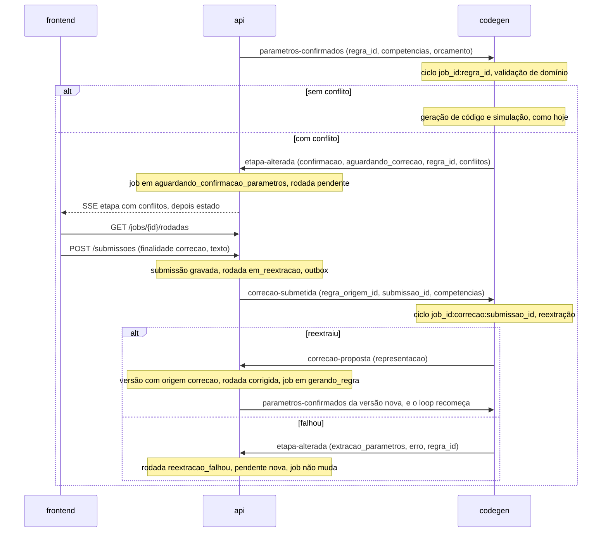

# Loop de correção

Use esta skill antes de tocar qualquer peça do loop de correção, em qualquer serviço. Ela descreve como as peças se encaixam. Como cada stack implementa a sua parte está na skill `correction-loop` do componente:

- api: [`api/.agents/skills/correction-loop`](../../../api/.agents/skills/correction-loop/SKILL.md)
- codegen: [`codegen/.agents/skills/correction-loop`](../../../codegen/.agents/skills/correction-loop/SKILL.md)
- frontend: [`frontend/.agents/skills/correction-loop`](../../../frontend/.agents/skills/correction-loop/SKILL.md)

O worker não participa do loop.

## Fontes de verdade

| O quê | Onde |
| --- | --- |
| Mensagens | `contracts/events/`: `parametros-confirmados`, `etapa-alterada`, `correcao-submetida` e `correcao-proposta` |
| Formato dos conflitos | `contracts/domain/conflitos-rodada.schema.json` |
| HTTP e SSE | `contracts/http/openapi.yaml`: `POST /submissoes`, `GET /jobs/{id}/rodadas`, `Rodada`, `EstadoRodada` e `EventoEtapa.conflitos` |
| Decisões do fluxo | [`docs/FLUXO-SPRINT-2.md`](../../../docs/FLUXO-SPRINT-2.md), seção 3 |
| Escopo de cada entrega | As tarefas T-214 a T-226 do épico E3 |

Quando o código e o contrato divergem, o contrato vence. Mudar o contrato segue a skill [`contract-change`](../contract-change/SKILL.md) e exige autorização.

## O fluxo

A primeira versão da regra chega ao codegen por `regra-submetida`, depois da extração. Toda versão seguinte chega por `parametros-confirmados`. Os dois abrem o mesmo tipo de ciclo, que começa pela validação de domínio.



## Quem é dono de quê

| Peça | Escreve | Lê |
| --- | --- | --- |
| Estado do job, transições e motivos | api, só por `MaquinaDeEstadosDoJob` | codegen anuncia por evento; frontend exibe |
| Rodadas (`rodadas_correcao`) | api | codegen com `SELECT`, para o histórico da reextração; frontend por `GET /jobs/{id}/rodadas` |
| Submissão da correção (`submissoes`, `tipo = texto`, texto em `transcricao`) | api | codegen pelo `submissao_id` |
| Versões da regra (`regras`), inclusive as de origem `correcao` | api | codegen pelo `regra_id`; o codegen só propõe a representação no corpo de `correcao-proposta` |
| Conflitos | codegen, por `validacao_dominio.verificar` | api grava como recebeu; frontend exibe o `motivo` como recebeu e troca as referências por rótulos do usuário |

Nenhum serviço reinterpreta os conflitos de outro. A api não os reescreve, e o frontend não deriva estado deles nem mostra `elemento_ref` na tela.

## Estados da rodada

| Estado | Aberta | Quem leva a ele | O usuário pode |
| --- | --- | --- | --- |
| `pendente` | sim | api, ao processar a pausa ou a falha de uma reextração | enviar uma correção |
| `em_reextracao` | sim | api, ao aceitar `POST /submissoes` | esperar |
| `reextracao_falhou` | não | api, ao processar o `erro` da reextração ou uma proposta que não muda a regra | tentar de novo na pendente nova |
| `corrigida` | não | api, ao aplicar `correcao-proposta` ou uma confirmação direta | nada; a versão nova segue |
| `abandonada` | não | api, ao cancelar ou arquivar o job com rodada aberta | nada |

O banco garante no máximo uma rodada aberta por job e no máximo uma sucessora por rodada.

## Transições conjuntas

É a tabela que cada consumidor e cada endpoint da api implementa. Toda linha acontece numa transação só, sob a trava do job.

| Gatilho | Condição | Job | Rodadas | Publica |
| --- | --- | --- | --- | --- |
| `etapa-alterada` `confirmacao` + `aguardando_correcao` | job em `gerando_regra`, sem rodada para o `regra_id` | vai a `aguardando_confirmacao_parametros`, motivo `validacao_com_conflitos` | abre `pendente`, com `rodada_anterior_id` na última do job | SSE `etapa` e `estado` |
| o mesmo | já existe rodada para o `regra_id` | nada | nada | nada (duplicada) |
| `POST /submissoes` | job em `aguardando_confirmacao_parametros` com rodada `pendente` | nada | `pendente` vai a `em_reextracao`, com a submissão | `correcao-submetida` |
| o mesmo | qualquer outro caso | nada | nada | 409 `estado_invalido` |
| `correcao-proposta` | rodada `em_reextracao` para `regra_origem_id`, representação nova | vai a `gerando_regra`, motivo `correcao_aplicada` | `corrigida`, com `regra_resultante_id` | `parametros-confirmados` com competências e orçamento |
| o mesmo | hash igual ao de uma versão que o job já tem | nada | `reextracao_falhou` e `pendente` nova | nada |
| o mesmo | sem rodada `em_reextracao` para a origem | nada | nada | nada (descartada) |
| `etapa-alterada` `extracao_parametros` + `erro` | job em `aguardando_confirmacao_parametros`, rodada `em_reextracao` | nada | `reextracao_falhou` e `pendente` nova com os mesmos conflitos e a mesma versão analisada | SSE `etapa` |
| o mesmo | job em `gerando_regra` | vai a `erro`, como hoje | nada | SSE `etapa` e `estado` |
| `POST /jobs/{id}/parameters` | job em `aguardando_confirmacao_parametros` com rodada aberta | vai a `gerando_regra` | a aberta vira `corrigida` com a versão confirmada | `parametros-confirmados` |
| `cancelar` ou `arquivar` | rodada aberta | estado terminal | as abertas viram `abandonada` | `job-encerrado` |

O mesmo `erro` em `extracao_parametros` tem dois significados. Quem decide qual vale é o estado do job, nunca o evento sozinho.

## Identidade dos ciclos no codegen

- **Ciclo de regra**: thread `job_id:regra_id` (`thread_do_ciclo`), aberta por `regra-submetida` na versão raiz e por `parametros-confirmados` nas seguintes. Uma regra com conflito termina o ciclo com sucesso de grafo, sem `interrupt()`. O único `interrupt()` continua sendo a espera pelo worker.
- **Ciclo de reextração**: thread `job_id:correcao:submissao_id`. Termina publicando `correcao-proposta` ou falhando de forma permanente na etapa `extracao_parametros`.
- O estado durável do loop mora na api, no job e nas rodadas. Nenhum ciclo do codegen espera o usuário, e sair da tela não deixa nada pendurado no codegen.

## Idempotência e ordem

As filas são independentes e a entrega é pelo menos uma vez. Cada passo tem a sua chave:

| Mensagem | Consumidor | Chave |
| --- | --- | --- |
| `parametros-confirmados` | codegen | thread `job_id:regra_id` e o guard de checkpoint do `entrypoint` |
| `etapa-alterada` de pausa | api | uma rodada por `(job_id, regra_id)` |
| `correcao-submetida` | codegen | thread por `submissao_id`, ids de prompt, resposta e trilha derivados |
| `correcao-proposta` | api | a rodada `em_reextracao` daquela origem, aplicada uma vez |
| `etapa-alterada` de falha da reextração | api | só age com rodada `em_reextracao` |

Três regras de ordem:

1. Toda decisão da api sobre o loop lê o estado do job e o da rodada na mesma transação, depois de travar a linha do job.
2. A deduplicação vem antes da transição. Uma pausa reentregue de uma versão antiga encontra o job em `gerando_regra` por causa de uma versão nova; se a transição viesse primeiro, ela pausaria o ciclo errado. Confira também que o `regra_id` da pausa é a versão mais recente do job.
3. Na api, a publicação sai pelo outbox na mesma transação da mudança de estado. No codegen, a publicação que encerra o ciclo é a última coisa do nó. Uma publicação repetida pela reexecução de um nó é absorvida pela chave do consumidor.

## Conteúdo que fica onde está

- O texto da correção mora em `submissoes.transcricao`. Aparece na resposta de `GET /jobs/{id}/rodadas`, no histórico do próprio usuário, e no prompt da reextração, no compartimento de dado não confiável. Nunca vai para log, métrica, span, mensagem de exceção, evento ou armazenamento do navegador.
- O `motivo` dos conflitos e a representação da regra só aparecem nos eventos que o contrato define e no banco. Logs levam contagens e referências (`elemento_ref`, ids).
- O texto da correção é dado, nunca instrução. Não escolhe nó, aresta nem ferramenta.
- Labels de métrica são de conjunto fechado (`resultado`, `causa`). `job_id`, `regra_id`, `submissao_id` e o id da rodada ficam no log.

## Ordem de implementação

O loop só entrega valor quando roda inteiro. Monte primeiro o caminho mínimo de ponta a ponta e endureça depois:

1. Estrutura: T-214.
2. Pausa: T-219 no codegen e T-215 na api.
3. Correção: T-216 na api, T-220 e T-221 no codegen.
4. Fechamento do laço: T-217 na api e T-218 no codegen.
5. Tela mínima: T-222.
6. Endurecimento: T-224 (histórico na reextração), T-225 (abandono) e T-226 (histórico completo na tela).

Cada serviço desenvolve contra o contrato, sem esperar o outro: o frontend com respostas simuladas que validam no `openapi.yaml`, a api publicando no RabbitMQ o que o codegen publicaria, e o codegen consumindo o que a api publicaria.

## Exercitar o loop com o compose local

Os comandos supõem os nomes de container e as credenciais padrão de `deploy/docker-compose.yml`. Ajuste-os ao seu `deploy/.env`.

Filas, mensagens paradas e consumidores. Depois do fluxo, `parametros-confirmados`, `correcao-submetida` e `correcao-proposta` precisam ter consumidor e nenhuma mensagem acumulada:

```bash
docker exec synapse-rabbitmq rabbitmqctl list_queues name messages consumers
```

Fazer o papel do outro serviço, publicando direto na fila. Parta dos exemplos de `contracts/examples/events/` e troque os ids pelos do job em teste:

```bash
docker exec synapse-rabbitmq rabbitmqadmin -u guest -p guest publish \
  exchange=amq.default routing_key=etapa-alterada \
  properties='{"content_type":"application/json"}' \
  payload="$(jq -c --arg job "$JOB_ID" --arg regra "$REGRA_ID" \
    '.job_id = $job | .regra_id = $regra' contracts/examples/events/etapa-alterada-conflitos.json)"
```

Rodadas e transições gravadas:

```bash
docker exec synapse-postgres psql -U postgres -d synapse_db -c "
  SELECT estado, regra_analisada_id, regra_resultante_id, rodada_anterior_id, jsonb_array_length(conflitos)
  FROM rodadas_correcao WHERE job_id = '$JOB_ID' ORDER BY criada_em"
docker exec synapse-postgres psql -U postgres -d synapse_db -c "
  SELECT status_anterior, status_novo, motivo FROM job_transicoes
  WHERE job_id = '$JOB_ID' ORDER BY ocorrido_em"
```

Métricas depois de exercitar o fluxo: `curl -s localhost:8080/metrics` na api e `curl -s localhost:8001/metrics` no codegen. O compose local publica a api em 8080 e o codegen em 8001.

Uma verificação pelo compose complementa os testes de cada serviço, e não os substitui. No encerramento, informe quais passos do loop foram exercitados de ponta a ponta e quais só pelos testes do componente.
