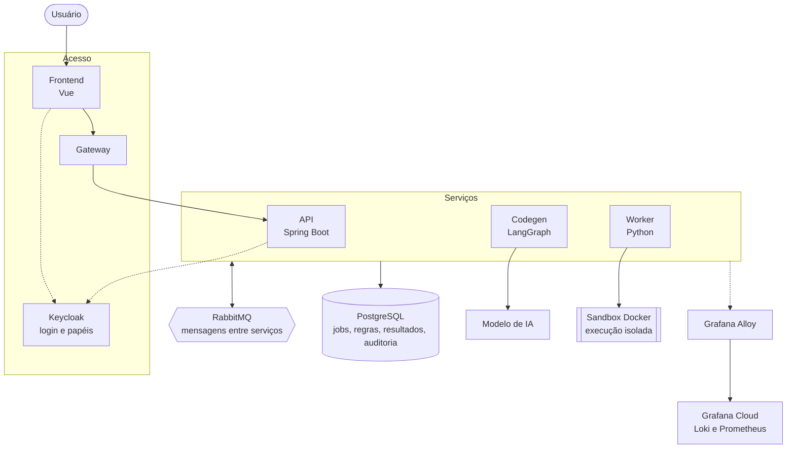

# Arquitetura do Synapse

Arquitetura orientada a eventos, com serviços independentes e comunicação assíncrona via mensageria.

## Como funciona

1. **Envio.** O usuário descreve a regra no frontend; a API registra o job.
2. **Interpretação.** O codegen entende a intenção, extrai os parâmetros da regra e gera o código correspondente com apoio de IA.
3. **Simulação.** O worker executa o código em um container isolado, sobre os dados históricos reais, e compara o resultado com o baseline e com o orçamento.
4. **Explicação.** O resultado é explicado e apresentado ao usuário, que decide confirmar, cancelar, salvar ou arquivar.

## Tecnologias utilizadas

<ul>
  <li>
       
        <b>Vue, TypeScript e Vite:</b> interface web para envio de regras, acompanhamento de jobs e visualização de resultados.</li>
  <li>  <b>Java 21 e Spring Boot:</b> API REST, estado dos jobs, atualizações em tempo real e migrations.</li>
  <li>  <b>Python e LangGraph:</b> interpretação das propostas, geração e explicação das regras.</li>
  <li> <b>Docker:</b> sandbox efêmero e isolado para executar as regras geradas.</li>
  <li> <b>RabbitMQ:</b> comunicação assíncrona entre os serviços.</li>
  <li> <b>PostgreSQL:</b> armazenamento de jobs, auditoria, regras e artefatos.</li>
  <li> <b>Keycloak:</b> login e controle de acesso por papel (profissional de RH e auditor).</li>
  <li> <b>Observabilidade: Opentelemetry, Grafana, Loki, Prometheus</b> </li>
  
  <
</ul>
