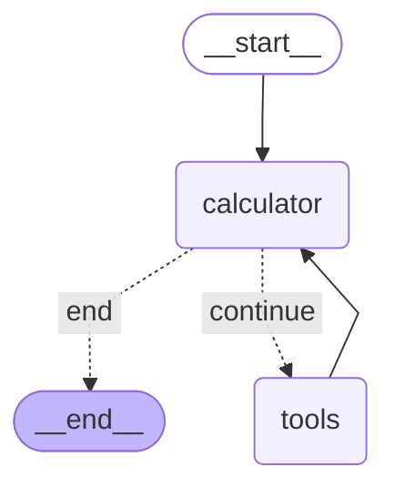

# Graph

Generated from `app/graph/core/engine.py`; do not edit by hand. Regenerate with `make graph`.

```mermaid
---
config:
  flowchart:
    curve: linear
---
graph TD;
	__start__([<p>__start__</p>]):::first
	calculator(calculator)
	tools(tools)
	__end__([<p>__end__</p>]):::last
	__start__ --> calculator;
	calculator -. &nbsp;end&nbsp; .-> __end__;
	calculator -. &nbsp;continue&nbsp; .-> tools;
	tools --> calculator;
	classDef default fill:#f2f0ff,line-height:1.2
	classDef first fill-opacity:0
	classDef last fill:#bfb6fc
```
