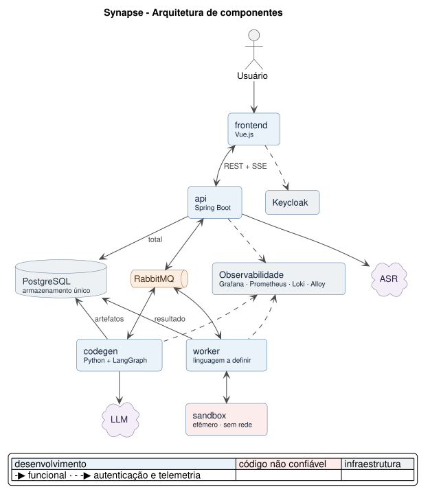

# Synapse - Documento de Arquitetura

Este documento descreve a arquitetura e seus requisitos. O fluxo de núcleo por formulário já está implementado; extração livre, chatbot, voz e as demais evoluções aprovadas para a Sprint 2 estão detalhadas em [Fluxo e decisões da Sprint 2](FLUXO-SPRINT-2.md), com distinção entre o estado existente e o planejado.

## 1. Contexto e objetivo

O **Synapse** apoia a gestão de regras de negócio de comissionamento (Parceiro **Dom Rock**), permitindo que um usuário capture uma nova regra por voz, tenha o conteúdo transcrito e convertido em código executável, simule seus resultados financeiros contra o cenário atual (baseline) e receba explicações e sugestões de ajuste antes de liberar a regra para produção.

Duas características do domínio direcionam as decisões de arquitetura:

- **Processamento assistido por IA de ponta a ponta** - transcrição de voz, extração de parâmetros, geração de código da regra e sugestão de adaptação (US02, US03, US06 do Product Backlog).
- **Código gerado por LLM é tratado como não confiável** - precisa rodar isolado antes que seu resultado alimente qualquer simulação ou relatório, e cada etapa do processo precisa ser **auditável** (US04) e **explicável** (US05).

Essas duas restrições - IA generativa no caminho crítico e execução de código não confiável - são o motivo da arquitetura ser assíncrona, orientada a eventos e com sandbox dedicado, em vez de uma API síncrona tradicional.

### 1.1. Por que gerar código, e não calcular de forma determinística

Se os campos da regra de negócio fossem fixos e mapeassem sempre para uma única fórmula (ex.: comissão = valor de venda × %, com poucos modificadores), calcular isso de forma determinística seria estritamente melhor do que gerar e executar código: mais rápido, 100% previsível, sem risco de alucinação e sem precisar do sandbox/Worker (seções 3.4 e 7).

A necessidade de gerar código vem da **variação na estrutura da própria regra**, não do cálculo dos campos em si - e o dataset enviado pela Dom Rock confirma isso concretamente (seção 1.2): a cada competência entra um conjunto novo de regras em texto livre, com formatos diferentes entre si (bônus fixo para uma lista de matrículas, % que muda só naquele mês para uma combinação marca+cargo, bônus por faixa de valor de venda, acréscimo sazonal por intervalo de datas). Não é um parâmetro variando dentro de uma fórmula fixa; é a forma da regra que muda. Algo precisa expressar lógica variável, não só valores de parâmetros; código gerado é uma forma de fazer isso (a alternativa seria um motor de regras/DSL configurável, sem LLM na execução - só na tradução do texto para essa DSL).

### 1.2. O domínio concreto: as bases e as regras da Dom Rock

O parceiro forneceu o dataset em `dataset_domrock/`: seis competências mensais brutas (Jul–Dez/2025) e uma especificação de processamento (`Especificacao.pdf`). Após a normalização da T-026, o dataset canônico publicado cobre cinco competências (Ago–Dez/2025); julho permanece apenas como evidência histórica pela decisão `EXCLUDE_2025_07`.

**Três bases, relacionadas por competência:**

| Base | Conteúdo | Granularidade observada (Nov/25) |
| --- | --- | --- |
| **RH** | Funcionário, cargo, loja, marca, admissão, demissão | 469 funcionários |
| **Vendas** | Lançamentos de venda por matrícula | 5.000 linhas, 454 matrículas, R$ 13,85 mi no mês |
| **Comissionamento** | % por marca × cargo | 30 combinações |

**A especificação tem três camadas, com destinos arquiteturais distintos.** O cliente agrupa as duas últimas sob o rótulo "intercorrências"; este documento as separa porque vão para lugares diferentes do sistema.

1. **Regras base** (item 5, a–g da especificação) - aplicação do % por marca+cargo; base do gerente (cargo 150) apurada sobre a venda total da loja; proporcionalidade por dias trabalhados em admissão e demissão; afastamento (<15 e >15 dias, com piso de R$ 3.500); férias. É estável, vale para toda competência e vem com exemplos numéricos trabalhados. **Implementado uma vez, como código determinístico** - não é regenerado a cada simulação.
2. **Eventos de RH** - fatos sobre pessoas. **Viram linhas de tabela**, não código.
3. **Regras da competência** - mudanças de política. **Viram código gerado pela IA.**

**O critério de classificação:** o item introduz *lógica nova*, ou apenas fornece *valores novos* a uma lógica que já existe? Quem estava afastado e em que período são valores para a regra 5e, que já está nas regras base. Já "vendas acima de R$ 40 mil ganham bônus por faixa" é lógica que não existia.

**Camada 2 - eventos de RH** (o que varia é *quem* e *quando*, não a regra):

| Tipo de evento | Exemplo na especificação |
| --- | --- |
| Afastamento por atestado | "MATRIC-58 apresentou atestado de 10/07 a 25/07" |
| Férias | "MATRIC-549 saiu de férias de 10/7 a 25/7" |
| Licença maternidade | "MATRIC-71, a partir de 01/10" |
| Correção cadastral | "ajustar a data de demissão do MATRIC-62 para 15/09/25" |

**Achado crítico - esses eventos só existem em prosa, e não há outra fonte.** As regras 5e, 5f e 5g dependem deles, mas **nenhuma coluna da Base RH os contém** - ela traz apenas `Data_Admiss` e `Data_Demiss`. O cliente não tem nem fornecerá uma base desses eventos: o texto da especificação é a única fonte que existe. Extrair essa estrutura é, portanto, **pré-requisito para o cálculo fechar** - não um recurso acessório. É o mesmo problema de extração que a captura por voz resolve (US02/US06), por outro canal de entrada.

A extração acontece **uma vez, no script de preparação**, e seu resultado é uma tabela de eventos que passa a integrar o dataset embutido na imagem do sandbox (seção 1.3). Como é insumo de toda apuração - inclusive dos baselines - e não há gabarito externo para denunciar um erro (ponto em aberto 4, seção 15.2), essa tabela precisa de **conferência humana antes de ser congelada**. Um afastamento extraído com a data errada contamina silenciosamente todas as simulações daquela competência.

**Camada 3 - regras da competência** (catálogo do que o código gerado precisa saber expressar, e uma boa base de casos de teste):

| Formato | Exemplo na especificação |
| --- | --- |
| Alteração pontual de % | "só neste mês, marca 10 / cargo 300 sobe para 1,75%" |
| Empréstimo de tabela entre marcas | "o % da marca 20 será aplicado em todos os cargos da marca 10" |
| Acréscimo percentual com exclusão de cargo | marca 30 +0,5%, "não se aplica aos cargos de gerente" |
| Regra sazonal por intervalo de datas | Black Friday: +1% nas vendas de 24 a 30/11 |
| Bônus por faixa de valor | dez: 40–50 mil → R$ 3.500; 50–60 mil → R$ 4.000; > 60 mil → R$ 4.500 |
| Bônus condicionado a atributo cadastral | "admitidos até 10/10 no cargo 100 → +R$ 1.000" |

**A fronteira entre as camadas 2 e 3 não é sempre óbvia, e onde traçá-la é decisão de projeto.** Dois exemplos do próprio dataset:

- *"Os funcionários abaixo receberam um bônus fixo de R$ 500"*, seguido de oito matrículas. Pode virar código com uma lista fixa embutida, ou uma tabela de bônus ad hoc com oito linhas. **A segunda é melhor:** evita gerar código com identificadores fixos e mantém o que varia como dado.
- *"O gerente MATRIC-293 ficou 10 dias na LOJA-5 e precisa receber comissionamento proporcional a esta loja também"* - é um fato (ele trabalhou lá), mas as regras base não têm regra para gerente rateado entre lojas. A DEC-090 mantém esse caso fora das regras base; como julho não é publicado pela T-026, ele não participa dos baselines atuais. Se julho for reintroduzido, o fato e a lógica específica da competência precisam ser resolvidos antes da reapuração.

O princípio: **preferir dado a código sempre que a variação estiver em "quem/quando/quanto" e não em "qual lógica"**. Como consequência, a fronteira se move com o tempo - um formato que hoje exige código gerado pode ser promovido às regras base e, a partir daí, novas ocorrências dele viram apenas parâmetros.

**Observações sobre os dados** (levantadas na inspeção das planilhas):

- `Date_Ref` na Base Vendas tem **semântica dupla**: a maioria das linhas traz o dia 1º (competência), mas as vendas de 24 a 28/11 trazem a **data real da venda** - exatamente a janela da Black Friday, o que torna aquela regra computável. Um agrupamento ingênuo por `Date_Ref` trataria essas vendas como competência separada.
- "Venda individual superior a R$ 40 mil" (dezembro) significa o **total mensal consolidado por matrícula**, não uma transação: a maior venda individual da base é R$ 5.057.
- `BASE_COMMISS_FINAL.xlsx`, apesar do nome, é a **tabela de percentuais** (30 linhas de marca × cargo), não um resultado apurado.

### 1.3. O que "simular" significa: backtesting sobre período histórico

**Decisão: a simulação é um backtesting** - a regra proposta é recalculada sobre um período histórico que já aconteceu e comparada com o comissionamento apurado pela regra vigente.

**O período é escolhido pelo usuário**: todas as competências do dataset ou um subconjunto qualquer delas, não necessariamente contíguo. O padrão é o período inteiro. Um job cobre o período escolhido em **uma única simulação**, com os meses agregados num total só e num veredito só - não há uma simulação por mês. A contribuição de cada competência para a diferença aparece na decomposição do resultado (seção 3.3), o que permite ver qual mês puxou o número sem fragmentar o julgamento de viabilidade.

Simular o período inteiro em vez de um mês responde a pergunta que o negócio de fato faz: não "essa regra caberia no orçamento de novembro", e sim "essa regra se sustenta ao longo do tempo". Uma regra pode ser barata num mês fraco e estourar num mês de pico.

> **Backtest:** testar uma regra nova contra o passado. Em vez de adivinhar o futuro, recalculam-se meses que já ocorreram como se a regra nova estivesse valendo - mesmas vendas, mesmos funcionários, mesmas férias e afastamentos - mudando **só a regra**. Se em outubro a empresa pagou R$ 480 mil e a regra nova teria pago R$ 511 mil, a diferença de R$ 31 mil é causada pela regra, e por mais nada.

Motivos da decisão:

- **A comparação só significa algo se a única variável for a regra.** Projetando vendas futuras, um resultado ruim fica ambíguo: a regra é inviável, ou a projeção está errada?
- **Os dados não sustentam projeção.** Cinco competências canônicas publicadas, sem ciclo sazonal completo e sem ano anterior para comparar - um modelo de previsão carregaria mais incerteza do que o próprio efeito que se quer medir.
- **É o que o backlog pede.** A US01 compara com o "cenário atual (baseline)", e a US04 (cenário 1) exige que o registro contenha "a origem/fonte de cada dado processado" - o que pressupõe fonte real e rastreável até a linha da base, não estimativa.

"Futuros resultados", na US01, significa os valores que a regra produziria sobre as vendas consideradas. O backtest mantém o volume histórico. O cenário adicional da Sprint 2 pode variar esse volume com uma premissa explícita de crescimento uniforme; ele continua sendo uma simulação hipotética, sem previsão estatística ou causal.

**Limitação a declarar ao usuário:** o backtest mantém o comportamento histórico sob a regra nova. Não estima como mudanças de comissão alterariam as vendas. O cenário de vendas da Sprint 2 trata essa relação por hipóteses explícitas, porque os dados atuais não identificam o efeito causal.

**Consequência arquitetural:** como o container do Worker não tem acesso à rede (seção 3.4), as bases de todas as competências precisam estar dentro dele - qualquer subconjunto pode ser pedido numa simulação. Sendo estáticas e pequenas, ficam **embutidas na imagem do sandbox** - o container sobe com os dados já presentes, sem busca nem materialização por job. O worker busca o código pela referência do comando; seu conteúdo não trafega no evento.

#### O baseline

O baseline é uma **tabela apurada, guardada em arquivo** - uma por competência. Para novembro/2025, com valores ilustrativos:

| matricula | loja | cargo | base de cálculo | comissão |
| --- | --- | --- | --- | --- |
| MATRIC-422 | LOJA-13 | 100 | 32.400,00 | 810,00 |
| MATRIC-321 | LOJA-58 | 150 | … | … |
| … (469 linhas) | | | | |
| **TOTAL** | | | | **480.312,00** |

Como ela é produzida: **aplicando o `Especificacao.pdf` aos `.xlsx` daquela competência** - as regras base (itens 1 a 5) mais as regras da própria competência, que em novembro são a Black Friday e o adicional dos gerentes. É o "cenário corrente" que a US01 manda comparar.

**Baseline não é gabarito.** O gabarito seria o que a empresa *de fato pagou* - verdade externa, que só o parceiro pode fornecer e que não está no dataset. Calculá-lo a partir das tabelas é impossível por definição: sairia a nossa própria apuração, e conferir nossa conta contra nossa conta valida erro de digitação, não erro de interpretação da regra.

Sem gabarito, valores absolutos e diferenças são resultados do modelo de apuração implementado sobre o dataset, não uma confirmação do que a empresa efetivamente pagou. Usar os mesmos dados ajuda a controlar a comparação, mas não garante que erros de interpretação se cancelem na diferença. O baseline congelado, as asserções e os casos com resultado esperado sustentam a conferência interna.

**Calculado uma vez, na preparação.** Dados estáticos e regras já definidas resultam em cinco apurações constantes (Ago–Dez/2025; julho foi excluído na T-026), geradas pelo script de preparação e **embutidas na imagem do sandbox ao lado das bases normalizadas**. Cada uma guarda a apuração completa - total e quebras por loja e por matrícula -, porque as quebras são necessárias para conferir que a regra proposta alterou apenas aquilo que declarava alterar. A T-032 publica os JSONL, o manifesto de congelamento e as [regras e premissas documentadas](../worker/docs/t032-baselines.md); o empacotamento da imagem pertence à T-033.

**Quem usa:** o **worker** compara a apuração com o baseline, calcula a diferença e o veredito e persiste o resultado. O **codegen** consome os valores já apurados para encaminhar o fluxo; a **API** consulta o artefato e atualiza o estado do job; o **frontend** exibe os valores retornados.

#### Orçamento

A diferença percentual sozinha não responde "cabe no orçamento?", que é justamente o alerta que a US01 exige. Isso exige o total absoluto do cenário simulado e o **valor do orçamento** - que não está em nenhuma das bases nem na especificação.

**Decisão da Dom Rock: o orçamento é informado pelo usuário.** É parâmetro da simulação, preenchido junto com o período (seção 3.1); confrontá-lo com o total apurado é o que dispara o alerta visual de inviabilidade e o bloqueio da liberação para produção (US01, cenário 2).

**O orçamento é do período, não mensal.** Como o job agrega as competências num total só, é esse total que se confronta com o valor informado - um veredito para o conjunto. Um orçamento por mês exigiria N vereditos e não responderia "essa regra se sustenta ao longo do período".

Uma simulação completa, no caso mais simples de período de um mês: o usuário propõe *"marca 40 +0,3% para vendedores"*, escolhe **novembro** e informa orçamento de **R$ 485.000**. O sandbox apura o cenário com a regra nova → **R$ 492.100**. O Worker compara com o baseline guardado (R$ 480.312) → diferença de **+R$ 11.788 (+2,5%)**. Como R$ 492.100 excede o orçamento, a interface alerta e bloqueia a liberação.

Com um período mais largo, a mecânica é a mesma sobre valores somados: o apurado é a soma das competências escolhidas, o baseline é a soma dos baselines correspondentes, e a diferença é confrontada com um orçamento do período. Competência que fique fora da vigência da regra entra na soma pelas regras do baseline - ela conta no total, apenas sem o efeito da regra proposta, e aparece com contribuição zero na decomposição.

### 1.4. O que é IA e o que é determinístico

Exemplo de ponta a ponta, para uma regra real do dataset - *"Em novembro, todas as vendas de 24 a 30 terão +1% de comissão, exceto gerentes"*:

| Etapa | Quem executa | Informação usada |
| --- | --- | --- |
| 1. Entender a frase e extrair a estrutura da regra | **LLM** | A própria frase (ou a transcrição do áudio) |
| 2. Gerar o código Python da regra | **LLM** | Esquema das bases + regras base + estrutura extraída na etapa 1 |
| 3. Apurar o comissionamento | **Código determinístico**, no sandbox | As bases da competência (RH, Vendas, Comissionamento) |
| 4. Comparar com o baseline e emitir o veredito de viabilidade | **Código determinístico** (fora do container, no Worker) | Os dois valores apurados e o critério de orçamento |
| 5. Interpretar e explicar o resultado ao usuário | **LLM** | Os números e o veredito já apurados nas etapas 3 e 4 |

**O princípio central: nenhum número sai do modelo.** Toda aritmética acontece nas etapas 3 e 4, em código rodando sobre os dados reais. A LLM interpreta linguagem e escreve código - nunca calcula. Essa fronteira sustenta a auditabilidade exigida pela US04. A preservação e a consulta dos detalhes necessários para conferir cada valor ainda exigem a evolução de resultados descrita na Sprint 2.

#### Esquema anotado vai para o contexto; as linhas vão para o sandbox

| O que | Para onde vai | Por quê |
| --- | --- | --- |
| **Esquema anotado** - nome da coluna, tipo e amostra de **10 linhas** por base, mais as convenções conhecidas | Contexto do agente (etapa 2) | É o que o agente precisa para escrever código que referencia as colunas certas e trata os formatos reais |
| **Regras base** (itens 1 a 5 da especificação) | Contexto do agente (etapa 2) | O código gerado se apoia sobre elas |
| **As linhas das tabelas** - o dataset completo da competência | **Somente o sandbox** (etapa 3), como entrada do código | São o insumo da apuração: é o que torna a simulação um backtest, e não um palpite |
| **Resultado agregado e decomposto** - total do baseline, total simulado, diferença, desfecho das asserções, mais a contribuição de cada elemento da regra e de cada dimensão (loja, marca, cargo) | Volta ao contexto do agente (etapas 4 e 5) | Algumas dezenas de valores, para julgar viabilidade e explicar o resultado com decomposição (seção 3.3) |

Tudo que vai para o contexto é pequeno e **fixo** - entra direto no prompt, sem nenhuma busca envolvida.

**Por que a amostra de 10 linhas é necessária, e o nome da coluna não basta.** As convenções reais dos dados não são visíveis a partir do esquema, e errá-las produz código que roda sem erro e devolve valor errado. Casos concretos deste dataset:

- `Date_Ref` é **serial do Excel** (`45962`), não string de data - uma comparação com `'2025-11-01'` não encontra nada.
- `Date_Ref` tem **semântica dupla**: dia 1º para a competência, data real nas vendas da Black Friday (seção 1.2). Código que assume "uma competência = um valor" erra a regra de novembro.
- `%_Comiss` é **fração** (`0.025`), não `2,5` - dividir por 100 erra o resultado em duas ordens de grandeza.
- `Matricula` é **texto** (`MATRIC-422`), não inteiro - um join com tipo errado devolve vazio silenciosamente.
- `Cod_Cargo` 150 aparece com descrições diferentes conforme a marca (`GERENTE DE LOJA`, `GERENTE QUIOSQUE`).

A amostra serve para mostrar **formato**, não conteúdo - 10 linhas bastam para revelar todas as convenções acima, e o volume não cresce com o tamanho da base.

#### RAG: por que não agora

RAG resolve um problema de **tamanho**: quando o conhecimento é grande demais para caber no prompt, é preciso *buscar* apenas os trechos relevantes. Quando cabe, você simplesmente inclui - e isso é contexto, não RAG.

Hoje nada no projeto é grande o suficiente: o esquema das bases, as regras base e a especificação inteira (6 páginas) cabem confortavelmente num prompt. Adotar RAG agora significaria banco vetorial, pipeline de indexação e *chunking* para resolver um problema que o projeto não tem - com o efeito colateral de tornar o contexto **incompleto e não determinístico** (o *retrieval* traz os *top-K* trechos, não todos).

**RAG passa a fazer sentido quando a base de regras acumuladas crescer** - dezenas ou centenas de regras históricas, quando for preciso descobrir quais delas conflitam com a nova. Isso é o problema que o desafio nomeia ("a base de conhecimento de regras, em geral, não está registrada e, muito menos, organizada de forma a garantir seu pleno uso") e o caminho natural de evolução: detecção de conflito entre regras, aderência a políticas da empresa e sugestão de adaptação fundamentada em precedentes. Fica registrado como **evolução futura**, fora do caminho crítico das sprints atuais.

Em nenhum cenário, presente ou futuro, o *retrieval* é usado sobre as bases numéricas: apurar a venda de uma loja exige **todas** as linhas daquela loja, e uma busca por similaridade que traga apenas parte delas produz um total errado silenciosamente.

#### O código gerado roda com segurança - mas está correto?

O sandbox (seções 3.4 e 7) garante que o código gerado não é **perigoso**. Não garante que ele está **correto**. O risco real é o modelo produzir um código que executa sem erro e devolve um número plausível, porém errado - e nada disso é visível no resultado.

Três camadas de validação determinística, em ordem de esforço:

1. **Reprodução do baseline** - rodar as regras base sobre os eventos de RH da competência, sem nenhuma regra da camada 3, e conferir que o resultado bate com o comissionamento oficial. Valida o cálculo base. Depende de o parceiro fornecer ao menos uma competência já apurada (ponto em aberto 4, seção 15.2).
2. **Asserções invariantes (T-031)** - verificações internas que rodam dentro do sandbox em toda apuração, independentemente da regra: nenhum comissionamento negativo; comissão positiva exige origem válida e rastreável (venda, evento remunerado de RH ou regra da competência); a soma por loja bate com a soma por matrícula. Não leem baseline nem orçamento. A conferência da apuração base contra o baseline congelado é uma comparação separada, no worker (T-066). Uma violação de invariante é falha de cálculo, nunca inviabilidade orçamentária.
3. **Coerência com o escopo declarado da regra** - a estrutura extraída na etapa 1 diz o que a regra deveria afetar; o resultado é conferido contra isso. Se a regra declara "+1% para não-gerentes" e o comissionamento dos gerentes mudou, há erro no código gerado.

Essas verificações são código determinístico, rodam junto com a simulação e alimentam tanto o alerta ao usuário quanto a trilha de auditoria (US04).

### 1.5. A representação da regra

Entre a linguagem natural e o código gerado existe uma **representação estruturada da regra**, com núcleo e especificações. Na Sprint 2, ela é validada antes da geração. Problemas acionam um chatbot de correção; uma regra sem problemas segue automaticamente, sem confirmação manual obrigatória.

**Princípio: a regra é simulada por inteiro.** Todo elemento que o usuário especificou entra no código gerado e se reflete no resultado. Não existe simulação parcial, elemento aproximado, nem parte da regra que o agente decida não implementar. Se algum elemento não puder ser implementado, isso é **falha de geração** - o job para e reporta - e nunca um resultado incompleto apresentado como se estivesse completo. É inadmissível que o agente escolha o que dentro da regra vai ou não ser simulado.

**A representação enumera todos os elementos da regra**, cada um com identificador próprio:

- **Núcleo** — **vigência, loja, marca, cargo e percentual**, conforme `regra-nucleo.schema.json`. Campos omitidos, listas vazias e demais valores seguem as regras do contrato. Matrícula não é campo do núcleo; pode aparecer no alvo de uma especificação.
- **Demais elementos** - tudo o mais que o usuário especificou: faixas, condições, janelas de datas, exclusões, e o que mais aparecer. Nem toda regra os tem; **quando tem, valem exatamente como o núcleo**.

Todos os elementos informados são vinculantes. Completude é avaliada conforme o schema de cada elemento, sem exigir artificialmente campos que o contrato permite omitir.

**Vocabulário de construtos reconhecidos.** Alguns formatos aparecem com frequência e o sistema sabe identificá-los, o que rende campos nomeados, validação individual e melhor exibição no chatbot e na consulta da regra:

| Construto reconhecido | Campos que exige |
| --- | --- |
| Faixa de valor | limite inferior, limite superior, efeito de cada faixa |
| Condição por limiar | métrica, escopo de agregação, operador, limiar |
| Janela de datas | data inicial, data final, efeito no período |
| Exclusão | dimensão (cargo, marca, loja) e valores excluídos |
| Bônus fixo | alvo (lista de matrículas ou filtro), valor |

Isso é **auxílio de reconhecimento, não hierarquia de importância**. Um elemento que não corresponde a nenhum construto conhecido é representado como elemento próprio e tratado igual: permanece na representação, entra no código gerado e precisa de verificação no resultado. O vocabulário cresce com o uso - um formato recorrente é promovido a construto e passa a ter campos nomeados -, mas nenhuma regra é recusada, podada ou simplificada por não caber nele.

**Conferência de cobertura.** O código declara os identificadores de elementos que implementa, e o worker verifica a correspondência e a decomposição. Essa conferência detecta elementos omitidos, mas não comprova sozinha a interpretação nem a aritmética. Casos com resultado esperado precisam demonstrar a geração e a execução das especificações; a regra não pode ser liberada com implementação parcial.

A validação da US06 exige uma representação processável: núcleo válido conforme seu contrato e especificações completas e coerentes. Havendo problema, o chatbot aponta o elemento e recebe uma correção por texto ou voz; a regra é reextraída e revalidada até poder seguir.

**Completude não basta: a regra também precisa ser internamente coerente.** Uma regra pode ter todos os campos preenchidos e ainda assim não descrever nada simulável - por **parâmetro impossível** (um % que produz comissionamento negativo, uma faixa cujo limite inferior é maior que o superior, uma janela de datas que termina antes de começar) ou por **instruções que se contradizem** (a regra diz 3% e, adiante, diz que o teto é 1,5%; um cargo é incluído por um elemento e excluído por outro). São conflitos *entre* os elementos da representação e, por isso, detectáveis por **código determinístico sobre a própria representação** - antes de gerar qualquer linha de código e sem tocar as bases.

Essa verificação é o que sustenta o cenário 2 da US03: quando os parâmetros são criticamente incompatíveis, **não existe adaptação leve a sugerir**. O sistema aponta o conflito específico - quais elementos se contradizem, e em quê - e devolve a regra ao chatbot de correção, em vez de propor uma alternativa que já nasce inválida. É caso distinto do cenário 1, em que a regra é coerente e apenas não cabe no orçamento: ali há o que ajustar, e a sugestão é simulada antes de ser mostrada (seção 3.3).

**Atenção ao escopo de agregação.** Numa condição como "se a venda total chegar a R$ 50 mil", *venda total de quê* - da loja inteira, da marca dentro da loja, da rede? Cada leitura produz um número diferente e nenhuma delas falha: o código roda e devolve valor plausível. Por isso o escopo de agregação é campo obrigatório do construto, e sua ausência é bloqueio (US06, cenário 2). Ambiguidades de linguagem seguem a mesma lógica - um "se e somente se" dito pelo usuário quase sempre é ênfase, não bicondicional, e o chatbot solicita esclarecimento quando a validação identifica a ambiguidade.

**Faseamento.** A representação é desenhada **uma vez**, já preparada para elementos além do núcleo:

- **Sprint 1** - o formulário de campos fixos (seção 2.3) só permite *informar* o núcleo, então é só o que existe para simular. A limitação está no que pode ser inserido, nunca no que é simulado daquilo que foi inserido.
- **Sprint 2** - voz e texto livre permitem especificar qualquer regra, e a lista de elementos passa a ser preenchida por inteiro. O contrato não muda; apenas passa a ser usado em toda a sua extensão.

A Sprint 1 validou o pipeline de núcleo. A Sprint 2 amplia extração e geração, aplica validação no fluxo principal, integra correções e transcrição e evolui os resultados, a API e a interface. A execução do worker permanece agnóstica à lógica da regra; mudanças de persistência e de contrato do resultado continuam necessárias.

## 2. Visão geral

Arquitetura em microsserviços com processamento assíncrono de longa duração.

| Componente | Tecnologia | Papel |
| --- | --- | --- |
| Frontend | Vue.js (SPA) | Interface do usuário: gravação de áudio, validação de parâmetros, visualização de simulação, relatórios |
| API | Java Spring Boot | Porta de entrada síncrona (REST), orquestração de jobs, autenticação, SSE para o frontend |
| codegen | Python (LangGraph; FastAPI só para `/health` e `/metrics`) | Orquestra as etapas de IA: extração de parâmetros, geração de código da regra, sugestão de adaptação, explicação de decisões |
| Worker de execução | Python (consumidor RabbitMQ) | Executa o código gerado dentro de containers Docker isolados |
| Banco de dados | PostgreSQL | Armazenamento único do sistema: estado do job, regras, resultados, auditoria e artefatos (áudio, transcrição, código gerado, prompts), além do checkpoint do LangGraph. Cada serviço acessa com usuário próprio, com permissões restritas ao que lhe cabe |
| Fila de mensagens | RabbitMQ | Único canal de comunicação entre API, codegen e Worker; o evento de resultado usa exchange fanout, por ter dois consumidores independentes (ver catálogo na seção 6.3) |
| Autenticação | Keycloak, OIDC com PKCE e validação de JWT na API | Credenciais e sessão no Keycloak; autorização e vínculo local na API, conforme ADR-006 |

**Nomenclatura.** Os quatro componentes de desenvolvimento têm nome canônico em minúsculas, que é ao mesmo tempo o nome do diretório no monorepo (ADR 002) e o `service.name` da telemetria (seção 9). Em prosa, `api` aparece como "API" e os demais capitalizados quando iniciam frase - o nome canônico é o da primeira coluna.

| Nome | Diretório | `service.name` | Era chamado de |
| --- | --- | --- | --- |
| `frontend` | `frontend/` | `synapse-frontend` | Frontend |
| `api` | `api/` | `synapse-api` | Backend / API |
| `codegen` | `codegen/` | `synapse-codegen` | Servidor de Agentes |
| `worker` | `worker/` | `synapse-worker` | Worker de execução |



### 2.1. Por que microsserviços assíncronos

- O fluxo (voz → transcrição → geração de regra → execução em sandbox → simulação → explicação) é uma cadeia de etapas de IA e execução de código, cada uma com latência variável e não trivial (segundos a minutos). Uma chamada síncrona bloqueante não é viável.
- O desacoplamento via fila evita que uma etapa lenta (ex. execução de código) bloqueie o restante do fluxo, e permite que cada componente processe no seu próprio ritmo.
- Isolar a execução de código em um serviço próprio (worker) - separado do codegen - garante que uma falha ou tentativa de escape do sandbox não comprometa o processo que orquestra a IA.

> Nesta fase do projeto, cada componente roda em **uma única instância** (sem escalonamento horizontal). O desenho orientado a filas mantém os componentes desacoplados e prontos para escalar no futuro, mas isso não é um requisito atual - ver nota na seção 3.4.

### 2.2. Fluxo de ponta a ponta (visão de integração)

O fluxo abaixo é o desenho aprovado para a Sprint 2. O caminho existente de formulário começa com uma regra já estruturada; extração livre, transcrição e correções ainda precisam ser integradas.

1. O frontend envia a descrição da regra, em texto ou áudio, com o orçamento e o período, por `POST /submissoes`, a porta de entrada da regra no lugar do formulário. A API registra a submissão e cria o job na mesma transação. O job de texto nasce em `gerando_regra`; o de voz nasce em `aguardando_transcricao`, e o áudio é armazenado e transcrito pela API.
2. Depois de persistir o insumo, a API publica sua referência via outbox transacional. Não envia áudio ou transcrição pelo broker.
3. O codegen lê o texto no banco, extrai a regra completa e valida a representação. Uma regra processável segue automaticamente.
4. Problemas acionam o chatbot. Cada correção por texto ou voz é uma submissão própria, associada a uma rodada persistida; reextração e revalidação produzem versões novas até resolver os problemas.
5. O codegen gera e persiste o código e publica `executar-codigo` com sua referência, competências e orçamento. O grafo pausa aguardando a execução.
6. O worker executa no sandbox, verifica a saída, calcula o veredito e persiste o resultado. Dataset e baselines já estão na imagem.
7. O worker publica `simulacao-concluida`; API e codegen consomem por filas independentes da exchange fanout. A API atualiza o estado; o codegen retoma o ciclo.
8. Quando aplicável, a alternativa de regra é persistida e simulada antes da aceitação. O cenário complementar de vendas usa cálculo determinístico e premissas explícitas.
9. Uma regra viável pode ser salva como campanha. Finalização encaminha para salvos, que leva ao relatório; versões anteriores continuam no histórico.
10. Eventos de progresso alimentam o SSE. Artefatos e histórico ficam no banco; sair do chatbot não altera o estado corrente do job.

### 2.3. Faseamento por sprint: formulário antes da voz

- **Sprint 1:** fluxo entregue de núcleo por formulário, geração de código, execução em sandbox, comparação com o baseline, resultado e histórico. O núcleo tem cinco campos: vigência, loja, marca, cargo e percentual.
- **Sprint 2:** US02, US03 e US06, com entrada por texto e voz, extração de regra completa, validação e correção condicional. Inclui todos os construtos, cenário de vendas, rastreabilidade dos valores, nomes, campanhas e autocadastro/recuperação de senha.
- **Sprint 3:** exposição da auditoria e explicabilidade conforme US04 e US05. O fato de os artefatos já serem gravados não significa que todas as garantias ou telas dessas histórias estejam implementadas.

A Sprint 2 inicia a integração com núcleo mais `generico`, amplia os demais construtos e mantém uma prova de geração e execução com resultados esperados. Os serviços podem ser construídos em paralelo contra contratos; a integração deve acontecer desde o início, permitindo revisões semanais da PO.

A confirmação universal foi substituída pelo chatbot condicional: sem problemas, a regra avança; com problemas, o usuário corrige por texto ou voz. A mudança atravessa frontend, API e codegen. O worker já executa lógica arbitrária da regra, mas a expansão dos resultados exige ajustes na saída, na verificação e na persistência.

O escopo e as decisões de integração estão consolidados em [Fluxo e decisões da Sprint 2](FLUXO-SPRINT-2.md).

## 3. Detalhamento dos componentes de desenvolvimento

### 3.1. Frontend (Vue.js)

**Responsabilidade:** única superfície de interação do usuário; não contém lógica de negócio - toda decisão (viabilidade, sugestão, cálculo) vem da API/codegen. O frontend orquestra UX, estado de tela e feedback em tempo real.

**Telas / módulos principais** (mapeados às user stories):

| Tela / módulo | User Story | Responsabilidade |
| --- | --- | --- |
| Formulário de regra | US01 (Sprint 1) | Campos fixos da regra (vigência, loja, marca, cargo, % - vocabulário canônico da DEC-084), mais **período** (as competências a simular, padrão o período inteiro) e **orçamento** de comissionamento - ambos parâmetros da simulação (seção 1.3). Porta de entrada da Sprint 1, enviada por `POST /jobs`; na Sprint 2 dá lugar à descrição da regra - ver seção 2.3 |
| Descrição da regra | US02 / E1 / E4 (Sprint 2) | Porta de entrada da regra: descrição em texto livre ou falada, mais período e orçamento, enviada por `POST /submissoes` com `finalidade = entrada_inicial` |
| Captura de voz | US02 / E4 (Sprint 2) | Gravação e upload na entrada inicial e nas correções, em `multipart/form-data`; a API armazena e transcreve o áudio |
| Chatbot de correção | US06 / E3 | Exibido somente quando a validação encontra problemas; mostra o histórico completo, recebe texto ou voz e acompanha a reextração e revalidação. Sair preserva o estado para retomada |
| Acompanhamento de progresso | US01–US03 | Consome o stream SSE do job e exibe o estágio atual (transcrevendo, extraindo, gerando código, simulando, analisando) - evita tela "travada" durante processamento assíncrono longo |
| Simulação e comparação | US01 | Exibe resultado da simulação vs. baseline; alerta visual (ex. vermelho) quando inviável; bloqueia liberação direta nesse caso |
| Sugestão e cenário de vendas | US03 / E5 | Exibe alternativa já simulada no recorte suportado e cenário hipotético de vendas apurado deterministicamente. Aceitar a alternativa viável segue à finalização |
| Auditoria | US04 (Sprint 3) | Exibe a trilha de decisões da IA e as fontes de dados usadas, com o id da simulação, o timestamp e a versão da regra aplicada |
| Explicação da simulação | US05 (Sprint 3) | Exibe a narrativa e a decomposição da simulação (três níveis, seção 3.3), com extração para conferência técnica; sinaliza o registro marcado com baixa rastreabilidade de explicabilidade |
| Relatório final / ações | US07 | Emite o relatório confrontando a regra proposta com o baseline; ações de confirmar e liberar, cancelar, salvar ou arquivar; intercepta navegação/fechamento sem ação escolhida ("Deseja sair sem salvar?") |
| Histórico e salvos | US07 / E10 | Campanhas viáveis com nome, regra vigente e versões anteriores; salvos sem status, acesso ao relatório e reprocessamento sem sobrescrever o original |

**Aspectos técnicos a definir pela equipe de frontend:**

- Gerenciamento de estado (ex.: Pinia) para o estado do job corrente (parâmetros, progresso, resultado) e para sessão/autenticação.
- Roteamento (Vue Router) entre as telas acima, com guarda de rota autenticada: o Keycloak autentica via OIDC com PKCE, o frontend mantém os tokens apenas em memória e recupera a sessão por SSO silencioso ao recarregar. A guarda exige sessão autenticada; a aplicação das permissões por papel segue a tarefa do middleware de autorização.
- Cliente SSE via `fetch`, com `Authorization: Bearer`, reconexão automática e deduplicação de resultados. Cada abertura do stream aguarda a renovação do token pelo adaptador Keycloak.
- Cliente REST para as ações síncronas (submissão, consulta de histórico, ações de finalização), usando o mesmo transporte autenticado. Antes de enviar a requisição, o cliente chama `updateToken(30)`; uma falha transitória de renovação preserva a sessão e permite tentar novamente. Respostas 401 reiniciam o login.
- Validação client-side complementar (não substitui a validação da API) para reduzir round-trips óbvios.
- Acessibilidade e clareza de mensagens - requisito não funcional do parceiro é que o sistema seja usável por quem "não tem domínio de tecnologia".

### 3.2. API (Spring Boot)

**Responsabilidade:** porta de entrada única do sistema; dono do ciclo de vida e do estado do `job`; tradutor entre o mundo síncrono (REST/SSE com o Frontend) e o mundo assíncrono (RabbitMQ com codegen/Worker); aplica as regras de autorização e as regras de negócio de transição de estado (ex.: bloquear liberação para produção se a simulação for inviável).

**Organização do código:** a API é organizado por **domínio, no padrão vertical slice** - cada funcionalidade tem seu próprio módulo, contendo o que precisar (controller, service, acesso a dados) de ponta a ponta, em vez de pacotes horizontais compartilhados (um `controllers`, um `services`, um `repositories` genéricos para o sistema inteiro). Preocupações transversais (segurança, outbox, integração RabbitMQ, gestão de SSE, persistência) ficam num núcleo de infraestrutura reaproveitado por todas as fatias, não dentro delas.

**Fatias do fluxo:**

- **Recepção e transcrição (US02/E4):** o domínio `submissoes` recebe por `POST /submissoes` a descrição de uma regra nova e as correções, em texto ou áudio. Na entrada inicial, registra a submissão e o job na mesma transação, com origem `texto` ou `voz`; `/jobs` cuida do ciclo de vida do job e não recebe a descrição. Para áudio, chama o provedor de ASR. A chamada externa ocorre fora da transação; a transcrição e o anúncio de sua disponibilidade precisam ser persistidos de forma consistente.
- **Validação e correção (US06/E3):** mantém o endpoint de parâmetros estruturados existente e acrescenta o recebimento de correções textuais ou de voz por `POST /submissoes`, rodadas persistidas e consultáveis em `GET /jobs/{id}/rodadas` e um ciclo do codegen por versão corrigida, aberto por eventos.
- **Acompanhamento e resultado (US01/E9):** `GET /jobs/{id}` e `GET /jobs/{id}/events` apresentam estado e valores produzidos pelo worker. Detalhes de resultado e motivos precisam aparecer consistentemente em consulta e SSE.
- **Finalização, histórico e nomes (US07/E8/E10):** ações, histórico paginado e reprocessamento continuam sob responsabilidade da API. Nome pertence ao job; campanha é sua apresentação quando o resultado é viável. Reprocessar cria outro job e preserva a origem.
- **Auditoria (US04):** consulta da trilha por operação autorizada, com identificação da simulação, versão da regra e fontes. Essa superfície permanece uma entrega própria; não deve ser confundida com a persistência já existente dos artefatos.

**Infraestrutura compartilhada entre as fatias:**

- **Consistência entre criação do job e publicação do evento** - se a API cai entre salvar no Postgres e publicar no RabbitMQ, o job fica "perdido". Resolvido com **outbox transacional**: a criação do `job` e a gravação do evento numa tabela `outbox_event` acontecem na mesma transação Postgres; uma tarefa agendada (`@Scheduled`, já que roda em instância única) lê os eventos pendentes, publica no RabbitMQ e marca como enviado. Dispensa infraestrutura de CDC (ex. Debezium), ao custo de uma pequena latência (o intervalo do poller) entre a criação do job e a publicação do evento.
- **Dono do estado e das decisões** - a API é o único serviço que escreve nas tabelas que representam estado e decisão de negócio: `job`, transições da máquina de estados, trilha de auditoria, histórico. Worker e codegen gravam apenas os artefatos que eles mesmos produzem (resultado, código gerado, prompts), em tabelas próprias e com permissão restrita a elas (seção 6.2), e nunca chamam a API via HTTP para isso - publicam eventos com a referência da linha gravada. Assim a API segue como fonte única de verdade do que o usuário e o auditor veem, sem reintroduzir acoplamento síncrono entre serviços.
- **Integração RabbitMQ** - producer de `regra-submetida`, `parametros-confirmados` e `job-encerrado` (para o codegen); consumer de `simulacao-concluida` (do Worker, pela exchange fanout), `no-concluido` e `etapa-alterada` (do codegen, por fila simples). Ver catálogo completo na seção 6.3.
- **Persistência da trilha:** os eventos `no-concluido` recebem confirmação depois da gravação e permitem redelivery em falha. Transições e ações produzidas pela própria API são gravadas transacionalmente. O buffer em memória/arquivo para falhas de auditoria da US04 não está implementado e não pode ser considerado uma garantia atual.
- **Gestão de SSE** - mapeamento `job_id → emissores conectados`, para repassar cada evento de progresso consumido do RabbitMQ ao(s) cliente(s) Frontend inscritos naquele job. Também é o que sustenta a retenção do trabalho na saída abrupta (US07, cenário 2): o job vive na API, não na aba do navegador, então fechar a página não descarta o processamento - o Frontend apenas alerta antes de sair e reencontra o job no histórico.
- **Persistência (JDBC/JdbcTemplate)** - repositórios da tabela `job` e das tabelas relacionadas (ver seção 5), reaproveitados pelas fatias que precisam. Inclui os artefatos que a própria API produz: áudio (`bytea`) e transcrição, em tabela separada das de consulta frequente para não pesar o dia a dia.
- **Dono das migrations** - o schema é único e a API é quem o versiona, via Liquibase (seção 5), inclusive as tabelas que Worker e codegen escrevem. Eles inserem; não criam nem alteram estrutura.
- **Autenticação** - O [ADR-006](adrs/ADR-006.md) adota o Keycloak como provedor OIDC, responsável pelas credenciais e pela sessão. Com autenticação habilitada, a API atua como resource server do Spring Security: valida assinatura, emissor e validade do JWT recebido como Bearer nas chamadas REST e SSE. A API mantém o usuário local e seu vínculo com jobs pelo claim `sub`, persistido em `usuarios.keycloak_sub`.
- **Autorização** - A matriz HTTP da [DEC-087](decisoes/dec-087.md) exige profissional de RH nas rotas operacionais de jobs; o auditor permanece investigativo e só terá acesso entre usuários por operações de auditoria explicitamente autorizadas, fora da T-091. Um interceptor exige a declaração da operação e aplica a política central antes de executar o controller, interpretar o corpo ou abrir SSE. Rotas de jobs sem política são negadas. O papel é validado antes de criar ou atualizar a conta local; a posse vem de `jobs.usuario_id`. Cada reconexão SSE repete a autorização. Sessão inválida recebe 401; papel ou posse sem permissão recebe `403 sem_permissao`.

**Pontos de atenção para o desenvolvimento:**

- **Máquina de estados:** o contrato HTTP já contempla `aguardando_transcricao`, mas sua inclusão no enum e nas transições da API é trabalho de E4. `aguardando_confirmacao_parametros` sustenta a pausa para correções; sair da tela não encerra o job.

### 3.3. codegen (Python - LangGraph)

**Responsabilidade:** componente de IA generativa; conduz o fluxo como um grafo de estados (LangGraph) até a decisão final sobre a regra. Não executa código do usuário diretamente - delega ao Worker.

**Grafo implementado:**

```text
load_rule → code_generation → persist_response → extract_code
→ dispatch_execution → await_execution → decision
                                        ├─ suggest_adaptation → END
                                        └─ END
```

O estado ativo é `AgentState`, em `app/graph/core/state.py`. O grafo lê uma regra já estruturada, recebe o orçamento no evento de entrada e usa um ciclo por `job_id:regra_id`. Consome `regra-submetida`, `parametros-confirmados` e `simulacao-concluida.codegen`. A confirmação abre o ciclo da versão com competências e orçamento do evento; sem competências, é descartada sem falhar o job. A extração inicial e os demais passos do loop de validação/correção ainda precisam ser integrados.

O motor de extração e seu repositório existem separadamente do grafo (T-203). Usam a LLM configurada no registry e persistem prompt, resposta original e representação completa em uma transação; o artefato fica em `extracoes_regras`. A conexão ao grafo e a publicação pertencem à T-204; o consumo pela API e a criação da versão de `regras`, à T-202. Ver [extração no codegen](../codegen/docs/extracao.md).

**Evolução aprovada para a Sprint 2:**

1. Ler o texto persistido da submissão em `submissoes.transcricao`, digitado (origem `texto`) ou transcrito (origem `voz`). O evento carrega referência, não o texto ou áudio.
2. Extrair núcleo e especificações, preservando todos os elementos.
3. Validar a representação antes da geração. Problemas apontados levam ao chatbot; sem problemas, o fluxo segue automaticamente.
4. Reextrair correções por texto ou transcrição de voz, usando a regra atual e o histórico necessário. A API persiste as rodadas e versões e abre um ciclo do codegen para cada versão corrigida.
5. Gerar e persistir código e artefatos; delegar a execução ao worker e pausar aguardando o resultado.
6. Encaminhar o resultado e a alternativa no recorte suportado. O cenário de vendas usa apuração determinística, sem números produzidos pela LLM.

A API chama o provedor de transcrição. O codegen lê somente o texto, sem selecionar áudio. FastAPI expõe apenas `/health` e `/metrics`; toda comunicação interna de negócio continua pelo RabbitMQ.

**Explicação (US05):** a narrativa de negócio e sua conferência numérica são requisitos próprios, detalhados abaixo. O grafo ativo ainda não contém um nó de explicação; não se deve apresentar esse requisito como funcionalidade já entregue.

#### Explicabilidade: requisito de primeira classe, não relatório de fim de fluxo

A US05 pede que o sistema "seja capaz de explicar todas as decisões tomadas durante o processo de simulação", com a explicação **atrelada ao registro da simulação** e disponível para extração e conferência pela equipe de RH. O usuário-alvo é descrito no backlog como alguém que "não tem domínio de tecnologia", e o que se pede dele é confiar num número que vai virar política de remuneração. Ele precisa entender **como aquele número apareceu**, e o auditor precisa reconstruir o caminho meses depois.

O ponto de partida é favorável, e vem do desenho - não de uma técnica de XAI aplicada por cima. **O modelo não produz o resultado** (seção 1.4): não há caixa-preta cuja saída precise ser racionalizada a posteriori, porque o número vem de código determinístico rodando sobre linhas reais, e código e linhas estão ambos guardados. O que precisa ser explicado da IA é outra coisa: **como ela entendeu a regra** e **como traduziu esse entendimento em código**. Os dois são artefatos concretos e legíveis, não estados internos de um modelo.

**Três níveis, três públicos:**

| Nível | Para quem | Conteúdo | Quem produz |
| --- | --- | --- | --- |
| 1. **Narrativa** | Usuário de negócio | O que a regra fez com o custo, o que puxou a diferença, o que isso significa para o orçamento | Nó 8 (LLM) |
| 2. **Decomposição** | Gestor conferindo o número | Quanto cada elemento da regra e cada dimensão (loja, marca, cargo) contribuiu para a diferença em relação ao baseline | Código no sandbox (determinístico) |
| 3. **Trilha técnica** | Auditor (US04) | Representação validada, código gerado, prompts e respostas, modelo e versão, fontes de dados usadas | Todos os nós, via `no-concluido` |

O nível 1 **narra** o nível 2 - não o produz. É a mesma fronteira do nó 6: o agente explica o que o código apurou.

**Quatro propriedades que tornam a explicação verificável:**

1. **A explicação cita, não calcula.** Todo número na narrativa tem de existir no resultado da simulação. "Nenhum número sai do modelo" vale também para o texto explicativo - e vale inclusive para percentuais, proporções e variações, que são tão inventáveis quanto totais.
2. **Aderência numérica conferida por código.** Antes de exibir, os valores citados no texto do nó 8 são extraídos e conferidos contra os do resultado; um número que não corresponde a nada apurado é falha do nó, não texto a mostrar. É verificação barata, e pega a falha mais provável de uma explicação gerada: a cifra plausível e inventada.
3. **Reprodutibilidade.** O código gerado fica congelado e o dataset é estático (seção 1.3): reexecutar produz o mesmo número. A auditoria **reexecuta o código armazenado, nunca gera de novo** - a geração é não determinística, a decisão auditada não é, porque o artefato está guardado.
4. **A interpretação é validada antes de virar número.** A Sprint 2 aplica validação antes da geração e expõe no chatbot os problemas que exigem correção. Regras processáveis avançam sem confirmação manual universal; o histórico de problemas e correções precisa permanecer consultável.

**Quando a explicação falha, o resultado não é descartado.** A US05 (cenário 2) trata o caso do modelo devolver o resultado sem a justificativa das decisões: grava-se o resultado e marca-se a simulação com uma **flag de baixa rastreabilidade de explicabilidade**, sinalizando a falha para auditorias futuras. A mesma flag cobre o caso da propriedade 2 - narrativa reprovada na conferência numérica e, por isso, não exibida. A distinção que importa: **falha de explicação degrada a rastreabilidade; falha de cobertura ou de asserção invalida o número** (seções 1.4 e 1.5). A primeira é sinalizada, a segunda interrompe o job. Confundi-las é ruim nas duas direções - descartar uma simulação boa por causa de texto ruim, ou exibir um número errado por não ter parado a tempo.

**Explicação contrastiva.** Para quem decide, "por que não coube no orçamento" vale menos que "o que precisaria mudar para caber". A sugestão de adaptação (US03, nó 7) cumpre esse papel, com a exigência que a separa de um palpite: **a alternativa é simulada antes de ser mostrada** - passa pelos nós 4–6 como qualquer outra regra. O usuário lê "com 1,5% em vez de 2%, o custo fica em R$ X, dentro do orçamento", com o X apurado, não estimado pelo modelo.

O mecanismo existente usa uma tentativa automática de regra alternativa no recorte de núcleo. A Sprint 2 acrescenta a leitura de cenários de vendas descrita em [Fluxo e decisões da Sprint 2](FLUXO-SPRINT-2.md#5-vendas-e-alternativas).

**Explicar também o que não aconteceu.** Interrupção sem motivo é o pior caso para o usuário leigo. Todo caminho de parada devolve razão específica e localizada no elemento: regra fora do domínio (nó 2), elemento sem implementação correspondente (seção 1.5), asserção invariante violada (seção 1.4), campo obrigatório ausente (US06), conflito entre elementos da regra (US03, cenário 2). "Não foi possível processar" não é resposta aceitável em nenhum deles.

**Contrato de resultado e rastreabilidade.** O resultado atual contém totais, asserções e cinco quebras independentes de diferença. A Sprint 2 acrescenta matrícula e valores absolutos e considera a preservação dos dataframes resultantes. Ainda precisa ser confirmado se a consulta exige o cruzamento matrícula × loja × competência. Esses detalhes ficam no armazenamento e não no broker; a decomposição atual não permite reconstruí-los.

**O que se registra por nó**, além do descrito adiante nesta seção: identificação do modelo, provedor e versão usados, mais os parâmetros de geração. Uma explicação emitida hoje precisa continuar fazendo sentido quando o provedor tiver trocado o modelo por baixo.

**Integração - o que o codegen acessa, e como:**

| Recurso | Acesso | Uso |
| --- | --- | --- |
| **PostgreSQL** | Usuário próprio, com permissões restritas (seção 6.2) | Checkpoint do LangGraph; escrita dos artefatos que produz; leitura da transcrição e do resultado |
| **RabbitMQ** | Consumer e producer | Único canal de conversa com API e Worker |
| **API de LLM** | Chamada externa | Etapas generativas (extração, geração de código, interpretação, explicação) |

**Acesso ao banco de dados.** O codegen escreve no Postgres, e o que ele pode tocar é delimitado por **permissões do usuário de banco** - não há separação por schema. Concretamente:

| Permissão | Tabelas |
| --- | --- |
| Leitura e escrita | Checkpoint do LangGraph (estrutura criada pela própria biblioteca) |
| `INSERT` | Artefatos que o codegen produz: código gerado, prompt enviado, resposta do modelo |
| `SELECT`, `INSERT` e `UPDATE` só de `limpo_em` | Registro dos jobs encerrados (`jobs_grafo_encerrados`), que coordena a limpeza dos checkpoints (DEC-095) |
| `SELECT` | Transcrição do job e resultado da execução - o que precisam para trabalhar e retomar o grafo |
| **Nenhuma** | `job`, transições de estado, trilha de auditoria, histórico - tudo que representa estado e decisão de negócio |

O **checkpoint** existe porque o grafo pausa aguardando o usuário (nó 3) e o Worker (nó 5); esse estado não pode viver só na memória do processo. Usa-se o checkpointer oficial do LangGraph com API em PostgreSQL.

O isolamento é aplicado pelo banco, não por disciplina de código: uma tentativa de escrever em `job` falha por permissão. Há ainda uma segunda barreira, estrutural - o código do codegen não tem mapeamento para essas tabelas; o caminho não existe.

**Registro de auditoria por nó.** Cada nó, ao concluir, grava seus artefatos no Postgres e publica um evento `no-concluido` com a referência; a API consome, registra a trilha e a associa ao job. É o que sustenta a US04 - cada registro carregando id da simulação, timestamp, versão da regra aplicada e as fontes usadas (cenários 1 e 3). Explicação ausente ou reprovada não entra aqui como perda de trilha: é a flag de baixa rastreabilidade da US05 (cenário 2).

| Vai no evento (leve, ~1–2 KB) | Vai para uma tabela própria |
| --- | --- |
| `job_id`, nó, timestamp, versão da regra aplicada, decisão tomada, fontes de dados usadas, referências das linhas gravadas | Prompt enviado, resposta do modelo, código gerado, texto da explicação |

Sem essa separação, um evento com o prompt inteiro - que inclui o esquema anotado com amostra e as regras do motor permanente - passaria de 50 KB, e o broker viraria armazenamento. Com ela, um job inteiro (cerca de 10 a 20 eventos, contando as repetições do laço de sugestão) fica na casa das dezenas de KB no total, e quem abrir a auditoria e quiser ver o prompt exato o busca pela referência.

**Convenções implementadas e cuidados:**

- `AgentState` é o estado ativo. O orçamento chega no evento; o codegen não consulta a tabela de jobs.
- Consumers e producers usam RabbitMQ. A montagem padrão da aplicação já conecta o roteador real ao grafo.
- O checkpointer usa PostgreSQL via psycopg; `setup()` roda no início da aplicação. Cada versão tem seu próprio `thread_id`.
- Artefatos e eventos precisam ser idempotentes. O `evento_id` de trilha é derivado deterministicamente do job, nó e referência do artefato.
- Texto original, correções e respostas de modelos são dados não confiáveis. Não devem ser tratados como instruções para o serviço nem copiados para logs.
- Os checkpoints de um job são removidos depois que a API anuncia o encerramento (`job-encerrado`). O registro em `jobs_grafo_encerrados` permanece e reconhece as reentregas que o checkpoint final reconhecia; um ciclo que ainda espera um resultado só é removido depois de processá-lo (DEC-095).

### 3.4. Worker de execução

**Responsabilidade:** único componente autorizado a rodar código gerado por IA; existe para conter o raio de dano de um código malicioso ou alucinado.

**Estrutura interna:**

- **Loop consumidor** - inscrito na fila de "executar código" do RabbitMQ, com `prefetch` baixo (ex. 1) para não travar múltiplas execuções longas em uma única instância.
- **Preparação do container** - lê do Postgres o código a executar, pela referência do evento, e sobe um container a partir da **imagem do sandbox**, que já traz embutidos o dataset normalizado das cinco competências publicadas (Ago–Dez/2025) e os baselines apurados (seção 1.3). Só o código entra de fora. Como o container não tem rede, tudo que o código precisa ler tem que estar dentro dele antes de iniciar.
- **Execução isolada (Docker SDK)** - sobe um container efêmero por execução, com:
  - sem acesso à rede;
  - limites de CPU e memória;
  - sistema de arquivos somente leitura (exceto diretório temporário de saída);
  - timeout de execução (kill automático ao estourar).
- **Coleta de resultado** - captura stdout/stderr e o valor de retorno/artefato produzido pelo código; distingue erro do código do usuário (ex. exceção Python) de erro de infraestrutura (ex. falha ao subir o container). O resultado inclui o desfecho das **asserções invariantes** (seção 1.4), que rodam dentro do sandbox junto com a apuração - uma asserção violada indica erro no código gerado, não inviabilidade da regra, e os dois casos precisam chegar distinguidos ao codegen. O resultado vem **decomposto** por elemento da regra e pelas dimensões de agregação (loja, marca, cargo), não só como total: é o insumo do nível 2 da explicabilidade (seção 3.3), e o Worker o repassa como veio do container, sem recompor.
- **Veredito de viabilidade** - o container produz apenas números crus; é o processo do Worker, **fora do container**, que aplica o critério de orçamento (recebido no comando de execução; o dataset permanece na imagem) e determina se a regra é viável. Fica fora porque, dentro, o veredito estaria no mesmo processo do código gerado não confiável, que poderia adulterá-lo. Calcular o veredito aqui mantém API e codegen como consumidores simétricos do mesmo evento - se viesse da API, o codegen teria de esperar por ele, criando a dependência que a exchange fanout existe para evitar. Aplicar o veredito na máquina de estados (bloquear a liberação para produção) continua sendo da API, seção 3.2.
- **Publicação do resultado** - grava o resultado no **Postgres**, numa tabela própria em que tem `SELECT` e `INSERT` (seção 6.2), e publica o evento `simulacao-concluida` (sucesso ou erro, com a referência da linha, os totais apurados e o veredito) numa **exchange fanout** do RabbitMQ, para que API e codegen consumam de forma independente, cada um pela sua própria fila. Se o evento se perder, o resultado não se perde junto: a linha é consultável e reconciliável depois.
- **Limpeza garantida** - remoção do container ao final da execução em qualquer cenário (sucesso, erro, timeout), com um mecanismo de verificação periódica (watchdog) para eliminar containers órfãos remanescentes de falhas do próprio worker.

**Aspectos técnicos do worker:**

- A imagem e as bibliotecas permitidas já estão definidas pelo componente. A apuração usa pandas e bibliotecas permitidas na imagem; executar o código continua restrito ao sandbox.
- O isolamento atual usa rede desabilitada, usuário não root, sistema de arquivos somente leitura e limites de recursos. Esses controles precisam ser preservados na evolução da saída.
- Nesta fase, apenas uma instância do worker roda por vez, processando as execuções da fila sequencialmente (`prefetch` 1); o desenho via fila deixa a porta aberta para múltiplas instâncias no futuro, sem exigir coordenação adicional entre elas, caso vire necessário.
- Classificação de falhas e sua relação com o `retry_count` do `job` (quais erros valem retry automático vs. quais exigem intervenção/nova geração de código pelo codegen).
- Métricas específicas: tempo de execução por job, taxa de sucesso/erro/timeout, número de containers ativos - relevantes tanto para operação quanto para dimensionar o pool de workers.

## 4. Componentes de infraestrutura

Serviços majoritariamente prontos, configurados para o contexto do projeto - menor esforço de desenvolvimento próprio, mais esforço de configuração/operação.

- **PostgreSQL** - armazenamento único do sistema: estado do job, regras, resultados, trilha de auditoria, artefatos (áudio, transcrição, código gerado, prompts) e o checkpoint do LangGraph. Schema único; o isolamento entre serviços é feito por **usuário de banco com permissões restritas** (seção 6.2), não por separação de schemas.
- **RabbitMQ** - barramento de eventos entre API, codegen e Worker, e único canal entre eles. Filas segregadas por tipo de evento; apenas `simulacao-concluida` usa **exchange fanout**, por ter dois consumidores independentes (API e codegen). Catálogo completo na seção 6.3.
- **Observabilidade (Grafana, Prometheus, Alertmanager, Loki, Grafana Alloy/Grafana Cloud)** - ver seção 8.

### 4.1. Por que um único armazenamento, sem object storage

Uma versão anterior desta arquitetura tinha MinIO ao lado do Postgres, guardando os artefatos volumosos. Foi descartado: para o porte deste projeto, o serviço a mais custava mais do que entregava.

**O volume não justifica.** A ordem de grandeza é de ~1 MB por job somando áudio, prompt, resposta, código e resultado; algumas centenas de jobs de demonstração ficam na casa das centenas de MB. E o maior artefato - o dataset - nem transita pelo sistema: é estático e vive embutido na imagem do sandbox (seção 1.3).

**A natureza do conteúdo também não.** Transcrição, código gerado, prompt, resposta e resultado são texto e JSON, que cabem naturalmente em `text` e `jsonb`. Binário mesmo, só o áudio da Sprint 2, e em volume pequeno.

**O que se ganha ao consolidar:**

- Um serviço a menos para subir, documentar no Manual de Instalação (entregável avaliado), monitorar e credenciar.
- **Atomicidade.** Com dois armazenamentos, gravar o artefato e registrar sua existência são operações que podem divergir. Com um só, o artefato, a linha do job e o evento do outbox cabem na mesma transação (seção 3.2).
- **Sem órfãos.** Se um evento se perde, o artefato continua consultável por SQL e reconciliável - ao contrário de um objeto no storage, que ninguém sabe que existe.

O que continua valendo do desenho anterior é a regra de que **as mensagens carregam referência, não conteúdo** (seção 6.1). Ela não dependia do MinIO: o destino do artefato mudou, o padrão de integração não.

**Custo aceito:** o banco cresce com os artefatos e não tem expiração automática por linha, que uma política de lifecycle de bucket daria de graça. Com dataset estático, dados fictícios e volume de demonstração, nenhum dos dois pesa.

## 5. Persistência (PostgreSQL)

**O modelo de dados não vive neste documento.** Entidades, atributos, relacionamentos, índices e as estruturas dos campos `jsonb` são definidos em [`database/modelo-dados.dbml`](database/modelo-dados.dbml), que é a fonte canônica. Esta seção trata das decisões de arquitetura sobre persistência: quem escreve o quê, como o schema evolui e onde ficam as fronteiras.

**Schema único.** Não há separação por schema: todas as tabelas convivem no mesmo, e o que delimita cada serviço são as permissões do seu usuário de banco (seção 6.2). O princípio é que cada serviço escreve apenas os artefatos que produz: a API é dona do estado do job, das transições e da auditoria; codegen e Worker inserem nas tabelas dos artefatos que geram e leem o que precisam.

**Fronteira com o checkpoint do LangGraph.** As tabelas são criadas pela biblioteca e acessadas somente pelo codegen. Não há chaves estrangeiras com o domínio. O `thread_id` atual é `job_id:regra_id`; existe fallback legado por job, restrito ao mesmo ciclo. Checkpoint não é fonte de auditoria. A limpeza acontece depois do encerramento anunciado pela API, e o registro `jobs_grafo_encerrados` sobrevive a ela e preserva a deduplicação (DEC-095).

**Migrations:** a evolução do schema é versionada e aplicada via migrations, nunca manualmente. A **API é a dona das migrations**, inclusive das tabelas que Worker e codegen escrevem - eles inserem, não criam nem alteram estrutura. Ferramenta: **Liquibase** no formato **Formatted SQL** - arquivos `.sql` puros com diretivas em comentário (`--changeset`, `--rollback`). Decisão pela combinação de SQL direto (sem abstração) com suporte a rollback já no core open source, algo que o Flyway só oferece na versão paga (Teams). Os changesets são um arquivo `.sql` por tabela, encadeados por um changelog **raiz em YAML** que só faz `includeAll` - manifesto, não descrição de schema: nenhum DDL vive em markup. A raiz não é SQL porque `include`/`includeAll` em raiz Formatted SQL é recurso pago (Liquibase Secure 4.28+), e a escolha por Liquibase se sustenta justamente no core open source. Os scripts ficam no repositório da API e rodam automaticamente no start da aplicação ou como etapa do CI/CD (seção 12). A exceção são as tabelas de checkpoint do LangGraph, criadas pelo mecanismo de setup da própria biblioteca.

**Imutabilidade da representação da regra.** A representação estruturada (seção 1.5) é **versionada e imutável depois de usada** - uma edição posterior gera nova versão, nunca altera a que já produziu um resultado. Isso não é convenção de código: nenhum serviço tem `UPDATE` ou `DELETE` nas tabelas da representação, e a versão é congelada no primeiro uso. É o que mantém a trilha legível quando o usuário reprocessa uma regra arquivada com parâmetros diferentes (US07, cenário 3); sem isso, dois resultados apontariam para a mesma regra sem que se pudesse dizer qual apuração usou quais parâmetros.

**Registro de auditoria.** A US04 (cenários 1 e 3) exige um registro estruturado, consultável por banco **ou** por API, que amarre de forma inseparável o id da simulação, o timestamp, a versão exata da regra aplicada e a origem de cada dado processado. Como o modelo satisfaz essa exigência é assunto do `.dbml`; o que a arquitetura fixa é que a exigência existe e que a leitura pelo auditor não depende de acesso ao banco - o endpoint de auditoria da API (seção 3.2) serve a trilha.

## 6. Comunicação entre serviços

### 6.1. Três regras que valem para toda integração

1. **Serviços internos nunca se chamam diretamente.** API, codegen e Worker conversam exclusivamente por RabbitMQ. Não há endpoint HTTP de um para o outro - nem para gravar dado, nem para consultar estado.
2. **Mensagem carrega referência, não conteúdo.** Qualquer artefato volumoso (áudio, transcrição, código gerado, resultado, prompt) é gravado no Postgres pelo serviço que o produz; o evento leva só o id da linha. Mantém o broker leve e evita que ele vire armazenamento.
3. **Exchange fanout apenas onde há mais de um consumidor independente.** Hoje isso ocorre só com `simulacao-concluida`, consumido por API e codegen ao mesmo tempo. Os demais eventos têm consumidor único e usam fila simples.

### 6.2. Quem acessa o quê

O Postgres tem schema único; cada serviço conecta com **usuário próprio**, e são as permissões desse usuário que delimitam o que ele alcança. O princípio: **a API é o único escritor do estado e das decisões de negócio; cada serviço grava apenas os artefatos que ele mesmo produz.**

| | PostgreSQL | RabbitMQ |
| --- | --- | --- |
| **API** | Escrita de estado, decisões, histórico e outbox; dona das migrations; grava submissões e transcrições e consulta os artefatos dos outros serviços | Produz e consome |
| **codegen** | Checkpoint do LangGraph (leitura/escrita); `INSERT` e `SELECT` nos artefatos que produz - extração em `extracoes_regras`, código gerado, prompt, resposta e explicação; `SELECT` em transcrição e resultado. Nenhum `UPDATE` ou `DELETE` nos artefatos; no registro de encerramento (`jobs_grafo_encerrados`), `SELECT`, `INSERT` e `UPDATE` só de `limpo_em` (DEC-095). Nenhuma permissão sobre `job`, auditoria ou histórico | Produz e consome |
| **Worker** | `SELECT` e `INSERT` na tabela de resultados; leitura do código e da representação necessária à verificação | Produz e consome |

O dataset e os baselines não aparecem aqui: são estáticos e vivem embutidos na imagem do sandbox (seção 1.3), não no banco.

### 6.3. Catálogo de mensagens

**Convenção de nomes.** O nome revela a natureza da mensagem, e não apenas seu assunto:

- **Evento** - fato consumado, nomeado no **passado**. Quem publica anuncia e não depende de quem consome; pode haver zero, um ou vários consumidores.
- **Comando** - instrução dirigida a um destinatário específico, nomeada no **imperativo**. Tem um handler e uma expectativa de execução.

A distinção não é cosmética: um imperativo no catálogo é sinalizador de dependência dirigida, com semântica de retry e DLQ diferente - comando que falha exige recuperação específica, evento não consumido é apenas um evento não consumido. Nomear comando como se fosse evento esconderia esse acoplamento em vez de removê-lo.

| Mensagem | Tipo | Publica | Consome | Canal | Conteúdo |
| --- | --- | --- | --- | --- | --- |
| `regra-submetida` | Evento | API | codegen | Fila | `job_id`, origem (`formulario` \| `texto` \| `voz` \| `reprocessamento`), **competências do job** (todas, nunca uma), id da submissão e id da versão da regra conforme a origem; orçamento opcional no schema e já enviado pela API |
| `parametros-confirmados` | Evento | API | codegen | Fila | `job_id`, id da versão e, opcionalmente, competências e orçamento do job; abre o ciclo do codegen para a versão confirmada pelo usuário ou gravada a partir de `correcao-proposta`, sem retomar grafo pausado. Consumidor ativo no codegen; mensagens sem competências são descartadas. O envio do contexto pela API integra a T-217 |
| `correcao-submetida` | Evento | API | codegen | Fila | `job_id`, id da versão corrigida, id da submissão que guarda o texto da correção e, opcionalmente, as competências do job; contrato definido, publicação e consumo pendentes (E3) |
| `executar-codigo` | **Comando** | codegen | Worker | Fila | `job_id`, id da linha do código gerado, **competências a processar** (todas numa execução só), critério de orçamento |
| `simulacao-concluida` | Evento | Worker | **API e codegen** | **Fanout** | `job_id`, id da linha do resultado, status (`sucesso` \| `assercao_violada` \| `erro_codigo` \| `erro_infra`), totais apurados e veredito de viabilidade quando há sucesso |
| `regra-extraida` | Evento | codegen | API | Fila | `job_id`, `submissao_id` e `extracao_id` referenciam o artefato já persistido em `extracoes_regras`; a API lê e valida a associação antes de persistir a versão raiz com origem `extracao` e republicar `regra-submetida` com o id da versão. Consumo pela API implementado (T-202); publicação pendente (T-204) |
| `sugestao-adaptacao-proposta` | Evento | codegen | API | Fila | Origem, hash e representação alternativa, usados pela API para persistir uma versão e iniciar outro ciclo |
| `correcao-proposta` | Evento | codegen | API | Fila | `job_id`, id da versão corrigida, id da submissão da correção e representação reextraída, usados pela API para persistir a versão nova; contrato definido, publicação e consumo pendentes (E3) |
| `etapa-alterada` | Evento | codegen | API | Fila | `job_id`, etapa **iniciada**, status e, opcionalmente, o id da versão a que se refere e os conflitos que o chatbot mostra - repassado ao Frontend via SSE. `aguardando_correcao` na etapa `confirmacao` pausa o job para correção e exige versão e conflitos; `erro` em `extracao_parametros` durante a correção reabre a rodada em vez de encerrar o job. Publicação, transições e repasse dos conflitos pendentes (E3) |
| `no-concluido` | Evento | codegen | API | Fila | `evento_id` (uuid da mensagem, gerado pelo codegen; chave de idempotência da trilha), `job_id`, nó **concluído**, timestamp, conclusão do nó (resumo, fontes usadas e o que mais aquele nó registra), ids da versão da regra, da simulação, do prompt, do código gerado e da explicação, conforme o nó |
| `job-encerrado` | Evento | API | codegen | Fila | `evento_id` (id da transição terminal, o mesmo em toda emissão), `job_id`, status terminal (`liberado` \| `cancelado` \| `arquivado` \| `erro`) e o instante da transição; sai pelo outbox na mesma transação da transição terminal |

**Por que `executar-codigo` é comando.** O codegen dirige a execução a um destinatário específico e **pausa o grafo aguardando o resultado** - não é anúncio ao mundo, é delegação com expectativa de que alguém aja. Chamá-lo de `codigo-gerado` sugeriria que o produtor não depende de ninguém agir, quando é exatamente o contrário.

**`etapa-alterada` e `no-concluido` não são redundantes:** o primeiro dispara na **entrada** da etapa (é o que alimenta o "gerando código…" na tela) e o segundo na **saída** do nó (é o que alimenta a trilha de auditoria). Se algum dia os dois passarem a disparar no mesmo ponto, viram o mesmo fato com duas leituras, e mantê-los separados só criaria inconsistência entre o que a tela mostra e o que a auditoria registra.

A API publica `regra-submetida` pelo **outbox transacional** (seção 3.2), garantindo que nenhum job criado fique sem evento correspondente. `job-encerrado` também sai pelo outbox, na mesma transação que grava a transição terminal. As etapas da própria API (transcrição, por exemplo) não passam pela fila: ela as repassa direto ao SSE.

**Topologia no broker (DEC-089).** Toda fila simples tem o mesmo nome da mensagem que carrega: `regra-submetida`, `parametros-confirmados`, `regra-extraida`, `sugestao-adaptacao-proposta`, `etapa-alterada`, `no-concluido` e `job-encerrado`. A exchange fanout de `simulacao-concluida` também leva esse nome, e cada consumidor liga a ela a própria fila, nomeada `simulacao-concluida.<consumidor>` (`simulacao-concluida.api`, `simulacao-concluida.codegen`). Toda fila e exchange é **durável** e declarada sem argumento extra (`x-*`); API, codegen e Worker declaram cada um o próprio lado de forma **idempotente**, nunca exclusiva - a ordem de subida entre os três não é garantida, e uma declaração com argumento divergente do que já existe falha com `406 PRECONDITION_FAILED` em vez de silenciosamente perder a mensagem.

Os contratos de correção e o campo `conflitos` de `etapa-alterada` existem em `contracts/`, mas seus produtores, consumidores e filas são implementação de E3. O evento de cenário de vendas é trabalho planejado da Sprint 2. O catálogo acima não afirma que essas extensões já estão implementadas; ver [fluxo da Sprint 2](FLUXO-SPRINT-2.md).

**Claim-check de `regra-extraida` (T-203).** A representação deixou de ser permitida no evento, e `extracao_id` passou a ser obrigatório, por decisão explícita de cumprir o ADR-001. Essa mudança é incompatível com o payload anterior; publicação e consumo ainda não estavam implementados. A migration e os contratos devem estar presentes antes de ativar T-204/T-202. Não há exceção para o tamanho da regra: seu conteúdo completo permanece no banco. Os payloads de `sugestao-adaptacao-proposta` e `correcao-proposta` ainda exigem adequação própria ao ADR-001; essa pendência não autoriza copiar o conteúdo em `regra-extraida`.

### 6.4. Frontend ↔ API

- **REST** para as ações síncronas: submissão da regra e envio de correção por `POST /submissoes`, em JSON para texto e em `multipart/form-data` para voz, confirmação de parâmetros, consulta de histórico e das rodadas de correção, ações de finalização.
- **SSE** para acompanhamento em tempo real, sem polling. Cada etapa relevante - transcrição, extração, geração de código, execução no sandbox, interpretação do resultado - gera um evento de progresso, de modo que o usuário nunca fica esperando em silêncio durante um processamento que leva minutos.

## 7. Sandbox de execução de código

- O código gerado por IA é tratado como potencialmente malicioso - por alucinação do modelo ou por prompt injection vindo do texto da regra de negócio ditado pelo usuário (e, futuramente, de conteúdo recuperado por RAG, seção 1.4).
- Por isso é executado em ambiente isolado, sem acesso a recursos do sistema ou da rede.
- O código gerado é obrigatoriamente **Python** - o sandbox do worker precisa suportar apenas um runtime Python isolado.

Fluxo (mapeia diretamente para US01/US03 - simulação e sugestão de adaptação de regra; detalhes de implementação na seção 3.4):

1. O agente gera o código a ser executado (regra de negócio traduzida em código simulável).
2. Ao terminar, grava o código no Postgres e publica um evento no RabbitMQ com a referência da linha.
3. O worker escuta esse evento e inicia o processamento: lê o código e sobe um container Docker com restrições (sem acesso à rede, entre outras), a partir da imagem que já traz o dataset e os baselines embutidos.
4. O worker grava o resultado no Postgres e publica um evento numa exchange fanout do RabbitMQ, com a referência da linha.
5. O codegen e a API consomem esse evento de forma independente: o codegen lê o resultado para retomar o grafo; a API atualiza o estado do job e o histórico.
6. O agente é retomado para analisar o resultado (ex.: comparar com o baseline, decidir se a regra é viável, gerar explicação para o usuário).

## 8. Rastreabilidade dos fluxos de negócio na arquitetura

A tabela abaixo conecta as user stories do backlog aos componentes que as implementam, para deixar explícito que a arquitetura cobre o escopo funcional aprovado:

| User Story | Sprint | Componentes envolvidos | Observação de arquitetura |
| --- | --- | --- | --- |
| US01 - simulação e comparação com baseline | 1 | codegen (geração de código da regra) → RabbitMQ → Worker (sandbox) → codegen (análise do resultado) → API (SSE) → Frontend | Ciclo completo do fluxo descrito na seção 7; o bloqueio da liberação por inviabilidade é aplicado na máquina de estados da API |
| US07 - relatório, ações de finalização e reprocessamento | 1 | API (regras de negócio de estado do job) → PostgreSQL → Frontend | "Liberar para produção" é bloqueado se a simulação indicar inviabilidade (critério da US01); saída sem ação não perde trabalho, porque o job vive na API; "Reprocessar" cria job novo semeado pelo arquivado (seção 3.2) |
| US02 - captura de voz e transcrição | 2 | Frontend (gravação) → API (upload, chamada ao serviço de ASR, gravação de áudio + transcrição no Postgres) | API faz a transcrição antes de publicar o evento; codegen recebe texto pronto, não o áudio. Áudio inaudível e conteúdo fora de domínio param o fluxo com mensagem específica (nó 2 do grafo) |
| US03 - sugestão automática de adaptação | 2 | codegen (LangGraph: nó de reformulação após simulação inviável) | Reaproveita o mesmo ciclo de execução em sandbox: a alternativa é simulada antes de ser mostrada (seção 3.3); descartar a sugestão devolve o usuário à edição manual |
| US06 - validação dos dados extraídos por voz | 2 | codegen (extração de parâmetros a partir da transcrição) → API (SSE) → Frontend (chatbot condicional de correção por texto ou voz) | Sem problemas, segue automaticamente; problemas geram rodadas persistidas, versões novas e revalidação antes de simular |
| US04 - registro dos dados processados | 3 | codegen (`no-concluido` por nó) → API (persistência da trilha, `GET /jobs/{id}/audit`) → PostgreSQL | Registro estruturado com id, timestamp, versão da regra e fonte de cada dado; falha de gravação não interrompe a simulação (seção 3.2) |
| US05 - explicação das decisões da simulação | 3 | codegen (nós 6 e 8) → API → Frontend / extração pelo RH | Explicação atrelada ao registro da simulação; ausência ou reprovação da narrativa gera flag de baixa rastreabilidade, não descarte do resultado (seção 3.3) |

## 9. Observabilidade

- **Logs:** todos os serviços geram logs estruturados (JSON) com timestamp, nível de log, serviço, mensagem e contexto adicional.
- **Métricas:** cada serviço expõe métricas de desempenho e saúde (tempo de resposta, taxa de erros, número de tarefas processadas etc.), coletadas e visualizadas em painel centralizado.
- **Stack:** Grafana, Prometheus, Alertmanager, Loki e Grafana Alloy (local) ou Grafana Cloud.
- Relevância para o domínio: como o processo é assíncrono e de longa duração, logs e métricas por `job_id` (correlação entre API, codegen e Worker) são o principal mecanismo de suporte à US04 (auditoria) e de diagnóstico de falhas no pipeline.

## 10. Uso de IA no desenvolvimento (harness)

O projeto é complexo e envolve várias etapas de processamento; o uso de IA generativa no desenvolvimento é obrigatório (requisito Fatec/Dom Rock). Para que isso não vire inconsistência, existe um *harness* que limita e padroniza como a IA é usada.

**O harness é uma espinha compartilhada com conteúdo por componente**, não um conjunto único de regras servindo os quatro. Regra que vale para Vue e para Spring Boot ao mesmo tempo desce ao mínimo denominador comum ("escreva testes", "siga o padrão"), e regra que não proíbe nada concreto não restringe nada.

| Camada | Escopo | Por quê |
| --- | --- | --- |
| Convenções - commit, PR, numeração de ADR, definição de pronto | Raiz | Independem de stack, e é o que dilui se cada componente decidir sozinho |
| Contexto do sistema - domínio, catálogo de eventos, invariantes, matriz de permissões | Raiz | Todo componente precisa; ninguém deveria redigir a própria versão |
| **Regras de stack e de segurança do componente** | Por componente | É onde mora o valor, e é o que não pode ser genérico |
| Gates de verificação | Por componente, com despacho na raiz | Os comandos são distintos; compartilha-se *quando* rodam, não *o que* rodam |
| Checks de contrato entre componentes | Raiz | Só existem porque o repositório é único (ADR 002) |

As regras por componente são de segurança do projeto, não de estilo - e é por isso que não podem ser fundidas: o codegen não emite número apurado e trata a transcrição como dado, nunca como instrução; o Worker nunca roda código gerado fora do container nem relaxa flag de isolamento; a API grava job e evento de outbox na mesma transação e não escreve em tabela de outro serviço; o Frontend não contém lógica de negócio nem calcula valor exibido.

**Arquivos de instrução.** `AGENTS.md` na raiz (curto - mapa e invariantes) somado ao `AGENTS.md` de cada componente, aproveitando que as ferramentas leem o arquivo mais próximo junto com os ancestrais. Skills em `.agents/skills/`: na raiz as que atravessam componentes (adicionar campo a um evento, criar migration com o `GRANT` correspondente), no componente as que não saem dele. Interoperabilidade entre ferramentas (Claude Code, Codex, Cursor, Antigravity etc.) por um arquivo canônico por diretório, com os demais nomes apontando para ele - nunca cópias, que divergem.

**Verificação.** Cada componente expõe um `verify.sh` com compilação, tipagem, linting e testes. O hook de pre-commit detecta os caminhos alterados e chama o `verify` de cada componente tocado - alteração só no frontend não dispara verificação da API -, e a CI chama exatamente o mesmo comando. Mudança em `contracts/` dispara o `verify` de todos, que é o teste de que o schema novo não quebra quem já consome. O hook existe para o feedback ser rápido; como é contornável e não se instala sozinho no clone, o portão real é a CI.

## 11. Estratégia de branches

- **`main`:** código de produção - o que será apresentado ao cliente na sprint review.
  - Nenhum commit direto. Alterações entram apenas via Pull Request, revisado e aprovado por pelo menos um revisor.
- **`staging`:** testes de integração e validação antes de produção.
  - Atualizada a partir da `develop` e, após os testes, mesclada na `main`.
  - A PO testa o que foi desenvolvido em `staging`; se aprovado, é feito o merge na `main`.
- **`develop` e `feature/<nome-da-feature>`:** integração contínua e branches de funcionalidade, que nascem de `develop` e retornam por PR.

Outras regras:

- Rodar os ambientes de desenvolvimento é responsabilidade do desenvolvedor.
- O frontend pode usar a API em `staging` para testes, pré-visualização e desenvolvimento, evitando rodar a API localmente.

## 12. CI/CD

- Roda testes automatizados, linting e validação de código em cada commit e pull request.
- O pipeline é responsável por construir, testar e implantar o código nos ambientes de staging e produção.

## 13. Fluxo de trabalho

- Tarefas publicadas no GitHub Projects, com labels para status, prioridade, tipo de tarefa, complexidade, responsável etc.
- Cada tarefa tem descrição detalhada, critérios de aceitação e data de conclusão.

**DoR e DoD** estão definidos no Product Backlog. Os itens que dependem desta arquitetura, e onde são atendidos:

| Item | Onde |
| --- | --- |
| DoR - Diagrama de macrofluxo acessível | Seção 2.2 e o diagrama de arquitetura (seção 2) |
| DoR - Modelo de dados acessível | Seção 5 - **pendente**: só a tabela `job` está definida (ponto em aberto 1) |
| DoR - Dados de treinamento disponíveis | Seção 1.2 - dataset entregue pela Dom Rock; a tabela de eventos de RH ainda depende da extração e da conferência humana descritas ali |
| DoD - Documentação de instalação finalizada | Seção 14 - decorre da definição dos serviços e do docker-compose |
| DoD - Código fonte executável, code review e teste de código | Seções 10 a 12 - harness, pre-commit e CI/CD |

## 14. Requisitos não funcionais do parceiro/Fatec - cobertura

| Requisito | Como é atendido |
| --- | --- |
| Manual de Instalação (Git) | A entregar junto ao repositório; decorre da definição dos serviços e docker-compose desta arquitetura |
| Manual do Usuário | A entregar; escopo de produto, não de arquitetura |
| Modelos LLM via API pública | Consumidos pelo codegen para extração, geração de código, sugestão e explicação; a API consome, à parte, um modelo/serviço de ASR dedicado para transcrição |
| Framework LangChain/LangGraph/LlamaIndex | LangGraph adotado no codegen |
| Framework coding assistido por IA | Ver seção 10 - harness padronizado |
| Vue.js no Frontend | Seções 2 e 3.1 |
| Spring Boot na API | Seções 2 e 3.2 |
| Vídeo tutorial para usuário leigo | A entregar; escopo de produto, não de arquitetura |

## 15. Decisões e pontos em aberto

### 15.1. Decisões tomadas

- **Linguagem do código gerado:** o código gerado pelo agente e executado pelo worker será obrigatoriamente Python. O sandbox Docker do worker (seções 3.4 e 7) precisa apenas suportar um runtime Python isolado (sem acesso à rede, com limites de CPU/memória, timeout).
- **Origem do baseline:** dataset canônico derivado do material entregue pela Dom Rock em `dataset_domrock/`. A fonte bruta cobre Jul–Dez/2025, mas a T-026 publica somente Ago–Dez/2025; julho fica como evidência histórica e não gera baseline corrente (seção 1.2).
- **Simulação = backtesting sobre período histórico:** a regra proposta é recalculada sobre um período que já aconteceu - o conjunto de competências canônicas publicadas ou um subconjunto escolhido pelo usuário - e comparada com o apurado pela regra vigente, isolando a regra como única variável. As competências são agregadas numa simulação só, com um total e um veredito para o conjunto. Não há projeção estatística de vendas futuras - as cinco competências publicadas não sustentariam um forecast, e ele introduziria incerteza maior que o efeito a medir (seção 1.3).
- **Três camadas, e a regra de fronteira entre elas:** o regras base (aplicação do %, regra do gerente, proporcionalidade de admissão/demissão/afastamento/férias) é código determinístico escrito uma vez; os eventos de RH (afastamentos, férias, correções cadastrais) viram linhas de tabela; apenas as regras da competência - mudanças de política descritas em texto livre - são traduzidas em código pela IA. O critério: prefere-se dado a código sempre que a variação estiver em "quem/quando/quanto" e não em "qual lógica" (seção 1.2).
- **Nenhum número sai do modelo:** a LLM interpreta linguagem e escreve código; toda a aritmética roda em código determinístico sobre as bases reais, no sandbox. É o que torna cada valor do relatório rastreável até as linhas que o produziram (US04) - ver seção 1.4.
- **A regra é simulada por inteiro:** todo elemento especificado pelo usuário entra no código gerado e se reflete no resultado. Não há simulação parcial nem elemento aproximado; o agente não escolhe o que dentro da regra vai ser simulado. Elemento sem implementação correspondente é falha de geração, e o job para em vez de devolver um número que parece completo. O vocabulário de construtos reconhecidos existe como auxílio de reconhecimento - dá campos nomeados e validação individual aos formatos frequentes -, jamais como filtro do que o sistema aceita: nenhuma regra é recusada ou podada por ter forma inédita (seção 1.5).
- **Esquema anotado no contexto, linhas no sandbox:** o agente recebe nome de coluna, tipo e uma amostra de 10 linhas por base (mais as convenções conhecidas, como `Date_Ref` em serial do Excel e `%_Comiss` em fração) - o suficiente para gerar código que trata os formatos reais. As linhas completas das tabelas são entrada do sandbox; amostras previstas no contexto não substituem a execução; o agente consome os valores já apurados que sua etapa precisa explicar; detalhes permanecem armazenados e são consultados por referência (seção 1.4).
- **RAG fica como evolução futura, fora do caminho crítico:** o conhecimento que a geração de código precisa (esquema das bases, regras base, especificação) é pequeno e fixo, e cabe direto no prompt - *retrieval* resolveria um problema de tamanho que o projeto ainda não tem, ao custo de tornar o contexto incompleto e não determinístico. RAG passa a fazer sentido quando a base de regras acumuladas crescer, para detecção de conflito e sugestão fundamentada em precedente (seção 1.4).
- **Validação determinística do código gerado:** o sandbox garante que o código não é perigoso, não que está correto. Toda apuração roda as três invariantes internas de T-031 (comissão não negativa, origem válida e rastreável e conciliação loja/matrícula). A conferência contra o baseline congelado cabe ao worker (T-066); a cobertura do escopo declarado cabe à T-056 e ao nó 7. As camadas são distintas (seção 1.4).
- **Explicabilidade como requisito de primeira classe:** a IA precisa ser explicável, e isso é propriedade do desenho, não relatório escrito no fim. Como o modelo não produz o resultado, não há caixa-preta a racionalizar a posteriori - o que se explica é o entendimento da regra e sua tradução em código, ambos artefatos guardados. São três níveis: narrativa para o usuário, decomposição determinística por elemento da regra e por dimensão (loja, marca, cargo), e trilha técnica para o auditor. A narrativa **cita e não calcula** - os números que ela menciona são conferidos por código contra o resultado apurado -, a auditoria **reexecuta o código armazenado em vez de gerar de novo**, a sugestão de adaptação é **simulada antes de ser mostrada**, e todo caminho de parada devolve motivo localizado no elemento, nunca um "não foi possível processar" (seção 3.3).
- **Progresso do processamento:** o usuário não deve ficar "no escuro" durante o processamento assíncrono - cada etapa relevante do fluxo (transcrição, extração de parâmetros, geração de código, execução em sandbox, análise do resultado) deve publicar um evento de progresso via SSE para o frontend, e não apenas o resultado final do job.
- **Postgres como armazenamento único, sem object storage:** o MinIO foi descartado. O volume não justifica um serviço a mais (~1 MB por job; o dataset, maior artefato, nem transita - vive embutido na imagem do sandbox), e quase todo o conteúdo é texto ou JSON. Consolidar dá atomicidade (artefato, linha do job e evento do outbox na mesma transação) e elimina artefatos órfãos quando um evento se perde (seção 4.1).
- **API como único escritor do estado e das decisões:** `job`, transições, trilha de auditoria e histórico só a API escreve. Worker e codegen gravam apenas os artefatos que eles mesmos produzem, em tabelas próprias, e publicam eventos com a referência da linha - nunca chamam a API via HTTP, o que reintroduziria acoplamento síncrono (seções 3.2 e 6.2).
- **Schema único, isolamento por usuário de banco:** não há separação por schema. Cada serviço conecta com usuário próprio, cujas permissões delimitam o que alcança - o worker tem `SELECT` e `INSERT` na tabela de resultado; o codegen, `INSERT` nos seus artefatos, `SELECT` no que precisa ler e acesso ao checkpoint do LangGraph, sem nenhuma permissão sobre `job` ou auditoria. O isolamento é aplicado pelo banco, não por disciplina de código (seção 6.2).
- **Dataset e baselines embutidos na imagem do sandbox:** são estáticos (não virão competências novas) e pequenos, e o container não tem rede. Embutir elimina busca e materialização por job; só o código a executar entra de fora (seção 1.3).
- **Coerência da regra é verificada por código, antes da geração:** além da completude (núcleo preenchido, cada elemento completo), a representação passa por uma verificação de consistência interna - parâmetro impossível (comissionamento negativo, faixa invertida, janela de datas que termina antes de começar) e instruções contraditórias (3% e teto de 1,5% na mesma regra; cargo incluído por um elemento e excluído por outro). São conflitos entre elementos, detectáveis deterministicamente sobre a representação, sem gerar código nem tocar as bases. É o que sustenta o cenário 2 da US03: onde não há adaptação leve possível, o sistema aponta o conflito específico e devolve à revisão manual, em vez de sugerir uma alternativa já inválida (seções 1.5 e 3.3).
- **Representação da regra é versionada e imutável depois de usada:** uma edição posterior gera nova versão, nunca altera a que já produziu um resultado. Vem da US04 (cenário 3), que exige a "versão exata da regra aplicada" amarrada ao registro de auditoria, e é o que mantém a trilha legível quando a US07 (cenário 3) reprocessa uma regra arquivada com parâmetros diferentes (seção 5).
- **Reprocessar cria um job novo, nunca sobrescreve o arquivado:** o job de origem fica intacto com sua trilha, e o novo é semeado com a representação anterior e com parâmetros e orçamento ajustáveis; a Sprint 2 aplica validação e aciona o chatbot somente se houver problemas (US07, cenário 3; seção 3.2).
- **Falha de explicação sinaliza; falha de cálculo interrompe:** se o modelo não devolve justificativa utilizável, ou se a narrativa é reprovada na conferência numérica, o resultado é gravado e a simulação recebe a flag de baixa rastreabilidade de explicabilidade (US05, cenário 2) - não se descarta uma apuração boa por causa de texto ruim. Já elemento sem implementação correspondente ou asserção invariante violada param o job, porque aí o número em si não é confiável (seções 1.4, 1.5 e 3.3).
- **Auditoria e explicabilidade são Sprint 3 na exposição, não no registro:** os artefatos (código gerado, resultado decomposto, prompts, respostas) são gravados desde a Sprint 1, porque é assim que o pipeline funciona. A Sprint 3 entrega a consulta pelo auditor, a retenção do registro em falha de persistência, a amarração obrigatória de id/timestamp/versão e a flag de explicabilidade. Começar a gravar só na Sprint 3 tornaria as sprints anteriores não auditáveis (seção 2.3).
- **Migrations com Liquibase (Formatted SQL), de propriedade da API:** arquivos `.sql` puros com diretivas em comentário (`--changeset`, `--rollback`), um por tabela, encadeados por um changelog raiz em YAML que só faz `includeAll` (manifesto, não schema - ver seção 5). Preferido ao Flyway porque dá SQL direto e rollback já no core open source - no Flyway, rollback automático é recurso pago (Teams). A API versiona inclusive as tabelas que Worker e codegen escrevem; eles inserem, não alteram estrutura. Todo changeset que cria tabela escrita por outro serviço inclui o `GRANT` desse serviço no mesmo changeset - sem isso a tabela existe, o `INSERT` falha por permissão em runtime, e o erro aparece longe da causa.
- **Monorepo poliglota, com implantação por host separado:** os quatro componentes vivem num repositório único, um diretório cada, sem ferramenta de build de monorepo - a raiz não é um projeto, e cada serviço mantém o layout que teria isolado. Isso não significa implantação conjunta: cada componente sobe no seu host, com a infraestrutura em serviços especializados. Decorrem daí um serviço por PR, evolução aditiva dos contratos, `contracts/` como insumo de build (nunca dependência de runtime) e verificação despachada por caminho alterado. Ver ADR 002 para o comparativo com repositórios separados e os custos assumidos.

### 15.2. Pontos ainda em aberto

1. **Retenção de áudio:** eventual expurgo após transcrição é uma política técnica ainda a definir; o armazenamento inicial já existe.
2. **Rastreabilidade do resultado:** confirmar com cliente/PO se bastam totais independentes ou se é necessário cruzar matrícula, loja e competência na mesma linha.
3. **Relação comissão–vendas:** solicitar à Dom Rock evidência adicional, caso espere uma estimativa de resposta das vendas à mudança de comissão. Sem isso, o cenário é hipotético e usa crescimento uniforme.
4. **Gabarito:** não há comissionamento efetivamente pago para conferir externamente os baselines. Os valores atuais são autoapurados; erros de interpretação não têm cancelamento garantido na diferença.
5. **Implementação técnica da Sprint 2:** provedor de ASR, busca de volume de vendas e persistência de detalhes ainda exigem definição e execução.

A ambiguidade do cargo 150 e as vendas órfãs já foram tratadas na normalização pelas políticas `CANONICAL_MANAGER_RATE` e `DISCARD_UNRESOLVED_ORPHAN_SALES`. Julho permanece excluído por `EXCLUDE_2025_07`. Esses pontos não são decisões pendentes da PO.

As decisões aprovadas sobre chatbot, áudio, nomes, campanhas e resultados estão em [Fluxo e decisões da Sprint 2](FLUXO-SPRINT-2.md).
