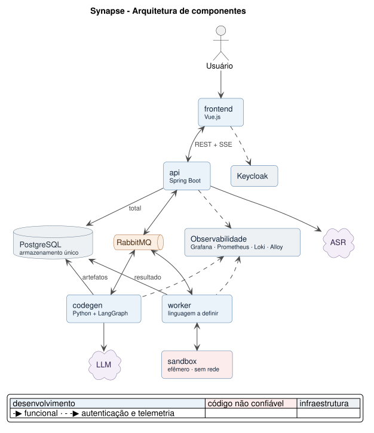

# ADR-001 - Arquitetura Assíncrona e Event-Driven

- **Data**: 2026-09-07
- **Deciders**: @pedro-fs-garcia

## Contexto

O **Synapse** (parceiro **Dom Rock**) permite que um usuário proponha uma regra de negócio de comissionamento, converte essa regra em código Python executável, simula seu efeito financeiro sobre uma competência histórica, compara com o cenário vigente (baseline) e explica o resultado antes de qualquer liberação para produção.

Cinco forças condicionam a arquitetura:

1. **O fluxo é uma cadeia de etapas de IA com latência de segundos a minutos**:
   - transcrição
   - extração de parâmetros
   - geração de código
   - execução em sandbox
   - interpretação
2. **Código gerado por LLM é tratado como não confiável**, por alucinação ou por *prompt injection* vindo do texto do usuário. Precisa rodar isolado, e o isolamento precisa conter o dano de um escape.
3. **Auditabilidade (US04) e explicabilidade (US05) são requisitos**, não subprodutos: cada etapa precisa deixar registro rastreável até a fonte, e o resultado precisa ser reproduzível.
4. **O usuário não pode ficar sem feedback** enquanto o processamento assíncrono acontece.
5. **Uma única instância de cada componente** nesta fase: não há escala horizontal a acomodar.

### Restrições tecnológicas do parceiro/Fatec: 
1. Vue.js no frontend
2. Spring Boot no backend
3. LangGraph como framework de agentes
4. modelos LLM consumidos via API pública

## Decisão

- Adotamos **microsserviços com comunicação de negócio exclusivamente assíncrona via RabbitMQ**. 
- Nenhum serviço interno chama outro por HTTP, nem para gravar dado, nem para consultar estado. 
- Cada serviço grava no PostgreSQL apenas os artefatos que ele mesmo produz, com **usuário próprio** no banco de dados, cujas permissões delimitam o alcance
- Cada serviço publica um evento carregando **a referência da linha, nunca o conteúdo** (*claim-check*). 
- O único canal síncrono é o de fora para dentro: REST do `frontend` para a `api`, e **SSE** da `api` para o `frontend`, para que o progresso chegue ao usuário em tempo real.
- **Eventos são nomeados no passado; comandos, no imperativo.** O nome revela a natureza da mensagem: evento é fato consumado, que o produtor anuncia sem depender de quem consome; comando é instrução dirigida, com handler e expectativa de execução. Hoje só `executar-codigo` é comando — o `codegen` pausa o grafo aguardando o resultado. Catálogo completo em ARCHITECTURE.md §6.3.

**Componentes e responsabilidades**

| Componente | Tecnologia | Responsabilidade |
| --- | --- | --- |
| `frontend` | Vue.js (SPA) | Única superfície de interação. Não contém lógica de negócio |
| `api` | Java Spring Boot | Porta de entrada única; dona do ciclo de vida e do estado do `job`, das transições, da trilha de auditoria e das migrations; faz a transcrição (ASR); traduz entre o mundo síncrono (REST/SSE) e o assíncrono (RabbitMQ) |
| `codegen` | Python + LangGraph | Componente de IA generativa extrai a representação da regra, gera o código Python, interpreta o resultado e explica as decisões. Não executa código do usuário |
| `worker` | Linguagem a definir; consumidor de fila + SDK do Docker | Único autorizado a executar código gerado por IA, sempre em container isolado; aplica o critério de orçamento fora do container e publica o resultado |

**Fluxo de ponta a ponta**

1. O `frontend` submete a regra (formulário ou áudio) à `api`.
2. A `api` transcreve o áudio quando houver, cria o `job` e publica `regra-submetida` - job e evento gravados na mesma transação, via **outbox transacional**.
3. O `codegen` conduz o grafo: extração dos elementos da regra → validação de domínio → **pausa** aguardando a confirmação do usuário (`parametros-confirmados`) → geração do código Python, gravado no Postgres.
4. O `codegen` publica `executar-codigo` com a referência do código e **pausa** de novo. O dataset não viaja: está embutido na imagem do sandbox.
5. O `worker` executa o código em container efêmero - sem rede, sistema de arquivos somente leitura, limites de CPU/memória e timeout -, coleta os números e o desfecho das asserções invariantes, aplica o critério de orçamento **fora do container** e grava o resultado.
6. O `worker` publica `simulacao-concluida` numa **exchange fanout**: `api` e `codegen` consomem de forma independente, cada um pela sua própria fila.
7. O `codegen` retoma o grafo, interpreta o resultado e explica; se inviável, propõe adaptação - que volta aos passos 4–6 e é simulada antes de ser mostrada.
8. Em cada nó, o `codegen` publica `etapa-alterada`, e ao concluir cada nó publica `no-concluido`; a `api` repassa o progresso ao `frontend` via SSE e persiste a trilha de auditoria.

**Infraestrutura**

| Serviço | Papel |
| --- | --- |
| PostgreSQL | Armazenamento único: estado do `job`, artefatos (áudio, transcrição, código gerado, prompts, resultado) e checkpoint do LangGraph. Schema único, um usuário de banco por serviço |
| RabbitMQ | Barramento de eventos e único canal entre serviços. Filas duráveis; exchange fanout apenas em `simulacao-concluida`, que tem dois consumidores independentes |
| Grafana, Prometheus, Alertmanager, Loki, Alloy | Observabilidade; logs, métricas e traces correlacionados por `job_id` |

## Consequências

**Positivas**

- Nenhuma etapa lenta bloqueia outra, e o usuário acompanha o progresso em vez de esperar por uma resposta que levaria minutos.
- O raio de dano do código não confiável fica contido no `worker`: um escape do sandbox não alcança o processo que orquestra a IA nem o dono do estado.
- Filas duráveis com `ack` após a gravação tornam indisponibilidade de banco um *redelivery*, e não perda de registro - o que sustenta a exigência da US04 de não perder trilha de auditoria.
- O isolamento entre serviços é aplicado **pelo banco**, via permissões de usuário: escrita indevida falha por permissão, não por disciplina de código.
- Eventos leves (referência, não conteúdo) mantêm o broker como canal de coordenação, e não como armazenamento.
- `api` e `codegen` consomem o resultado simetricamente pela exchange fanout, sem que um dependa do outro.

**Negativas**

- Depurar um fluxo distribuído e assíncrono é mais difícil que seguir uma pilha de chamadas; correlacionar logs e traces por `job_id` deixa de ser conforto e vira necessidade.
- A consistência é eventual: entre gravar o artefato e o consumidor reagir ao evento existe uma janela, e o outbox soma a latência do seu *poller*.
- O grafo pausa em dois pontos (confirmação do usuário e delegação ao `worker`), o que obriga a persistir e retomar estado - complexidade que um fluxo síncrono não teria.
- Quatro serviços, um broker e um banco elevam o custo de operação e de ambiente local para um time pequeno.
- Com instância única de cada componente, cada serviço é ponto único de falha. O desenho via fila deixa a porta aberta para múltiplas instâncias, mas isso não está em uso.

## Alternativas consideradas

- **Pipeline síncrono, com REST encadeado entre os serviços**: rejeitado  
    Etapas de minutos estourariam qualquer timeout razoável, o usuário ficaria sem feedback, e uma falha no meio da cadeia perderia o trabalho já feito.

- **Executar o código gerado dentro do próprio `codegen`**: rejeitado  
    Colocaria código não confiável no mesmo processo que orquestra a IA e detém as credenciais de LLM. A separação existe justamente para conter um escape de sandbox.

- **`worker` e `codegen` gravando via HTTP na `api`**: rejeitado  
    Reintroduziria acoplamento síncrono entre serviços e faria da `api` ponto de falha no caminho de gravação. Cada um grava o que produz, com permissão restrita, e anuncia por evento.

- **Eventos carregando o conteúdo (transcrição, prompt, resultado)**: rejeitado     
    Só o prompt passaria de 50 KB, e o broker viraria armazenamento. Adotado *claim-check*: o evento carrega a referência da linha.

- **Object storage (MinIO) ao lado do Postgres**: rejeitado  
    O volume não justifica um serviço a mais (~1 MB por job) e quase todo o conteúdo é texto ou JSON. Consolidar dá atomicidade entre artefato, `job` e evento do outbox na mesma transação.
