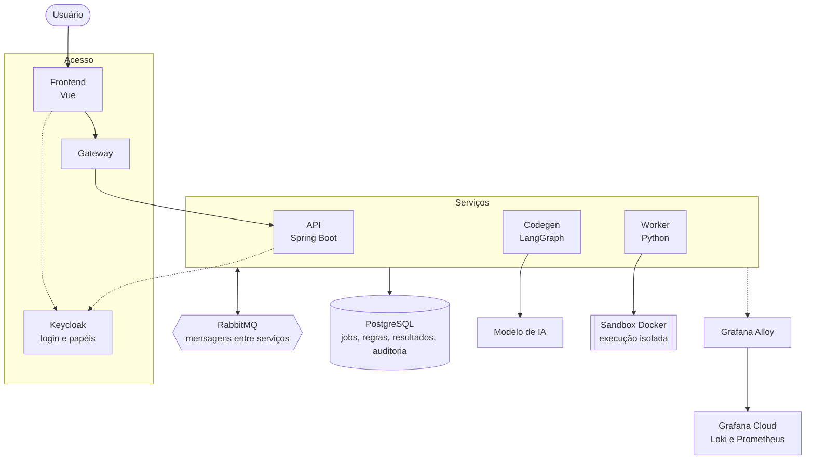

# Arquitetura do Synapse

O Synapse transforma uma proposta de regra de comissionamento em código executável, simula seu impacto financeiro sobre dados históricos reais e mantém uma trilha auditável de cada decisão.

A arquitetura é orientada a eventos, com serviços independentes e comunicação assíncrona via mensageria.

O fluxo de núcleo por formulário já está entregue. A entrada livre, o chatbot condicional, a voz e as demais evoluções aprovadas estão em [Fluxo e decisões da Sprint 2](FLUXO-SPRINT-2.md). A explicabilidade completa continua sendo um requisito de evolução.

## Como funciona

O desenho aprovado para a Sprint 2 segue estas etapas:

1. **Envio.** O usuário envia texto ou áudio; a API registra a submissão e controla o job. A API chama o provedor de transcrição quando houver áudio.
2. **Interpretação e correção.** O codegen extrai a regra completa e a valida. Problemas acionam um chatbot com correções por texto ou voz e histórico persistido; uma regra processável avança automaticamente.
3. **Simulação.** O codegen gera o código e delega ao worker, que o executa em sandbox e calcula os valores e o veredito deterministicamente.
4. **Resultado.** A API acompanha o estado e expõe o artefato persistido pelo worker. Uma alternativa precisa ser simulada antes da aceitação; cenários de vendas usam hipóteses explícitas, sem previsão causal.
5. **Campanha.** Resultado viável pode ser salvo como campanha, com nome, regra vigente, versões anteriores e acesso ao relatório.

## Decisões de arquitetura

- Como o código gerado por IA não é confiável, ele roda apenas no worker e sempre em um container Docker efêmero, sem acesso à rede ou ao banco.
- A IA apenas interpreta a proposta e gera o código, de modo que todos os valores exibidos vêm da execução sobre os dados reais, e nunca do próprio modelo.
- A API, o codegen e o worker não se chamam diretamente, pois toda a comunicação entre eles acontece de forma assíncrona por mensagens no RabbitMQ.
- Jobs, versões de regra, artefatos e decisões ficam relacionados no PostgreSQL e sob controle de acesso por papel. Rodadas de correção e detalhes para conferir quem receberia quanto, onde e quando ainda exigem as evoluções da Sprint 2.

## Tecnologias utilizadas

<table>
  <thead>
    <tr><th>Camada</th><th>Stack</th><th>Responsabilidade</th></tr>
  </thead>
  <tbody>
    <tr>
      <td><b>Frontend</b></td>
      <td> Vue &nbsp;  TypeScript &nbsp;  Vite</td>
      <td>Interface web para envio de regras, acompanhamento de jobs em tempo real e visualização de resultados.</td>
    </tr>
    <tr>
      <td><b>API</b></td>
      <td> Java 21 &nbsp;  Spring Boot</td>
      <td>API REST, máquina de estados dos jobs, atualizações via SSE e migrations.</td>
    </tr>
    <tr>
      <td><b>Codegen</b></td>
      <td> Python &nbsp;  LangGraph</td>
      <td>Interpretação das propostas, geração e explicação das regras, com grafo de estado retomável.</td>
    </tr>
    <tr>
      <td><b>Worker</b></td>
      <td> Python &nbsp;  Docker</td>
      <td>Execução do código gerado em sandbox efêmero e isolado.</td>
    </tr>
    <tr>
      <td><b>Mensageria</b></td>
      <td> RabbitMQ</td>
      <td>Comunicação assíncrona entre os serviços.</td>
    </tr>
    <tr>
      <td><b>Dados</b></td>
      <td> PostgreSQL</td>
      <td>Jobs, regras, resultados e trilha de auditoria.</td>
    </tr>
    <tr>
      <td><b>Identidade</b></td>
      <td> Keycloak</td>
      <td>Login e controle de acesso por papel (profissional de RH e auditor).</td>
    </tr>
    <tr>
      <td><b>Observabilidade</b></td>
      <td> OpenTelemetry &nbsp;  Grafana &nbsp; Loki &nbsp;  Prometheus</td>
      <td>Logs e métricas correlacionados por job.</td>
    </tr>
  </tbody>
</table>
