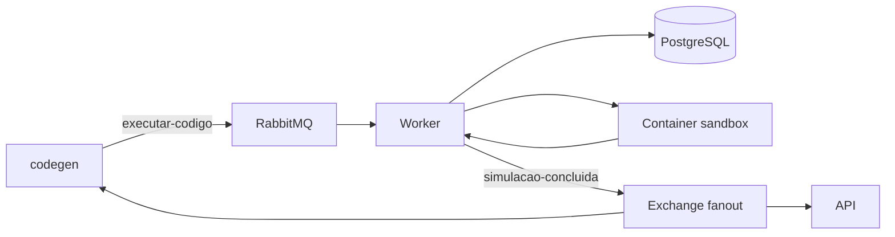

# Worker de Execucao

O `worker` e o componente responsavel por executar, de forma isolada, o codigo Python gerado pela IA durante uma simulacao de regras de comissionamento.

Ele recebe comandos pelo RabbitMQ, inicia um container Docker efemero para cada execucao, coleta o resultado, aplica o criterio de orcamento fora do sandbox, persiste o resultado no PostgreSQL e publica o evento de conclusao.

## Responsabilidades

- Consumir o comando `executar-codigo` no RabbitMQ.
- Buscar no PostgreSQL a referencia do codigo gerado.
- Executar o codigo somente dentro de um container Docker isolado.
- Disponibilizar no sandbox o dataset e os baselines da competencia.
- Capturar resultado, `stdout`, `stderr`, timeout e erros de infraestrutura.
- Preservar a decomposicao do resultado por regra, loja, marca e cargo.
- Aplicar o veredito de viabilidade comparando o total simulado ao orcamento.
- Inserir o resultado no PostgreSQL.
- Publicar `simulacao-concluida` em uma exchange fanout para a API e o `codegen`.
- Remover o container ao final, inclusive em caso de erro ou timeout.

O worker nao interpreta linguagem natural, nao gera codigo e nao decide se uma regra pode ser liberada para producao. Essas responsabilidades pertencem ao `codegen` e a API, respectivamente.

## Fluxo



O dataset nao transita pela fila. As bases normalizadas e os baselines devem estar embutidos na imagem do sandbox antes da execucao. O container recebe apenas o codigo e os metadados necessarios para a simulacao.

## Isolamento do sandbox

O codigo gerado e tratado como nao confiavel. Cada execucao deve usar um container descartavel com, no minimo:

- rede desabilitada (`network none`);
- usuario sem privilegios e sem acesso ao Docker socket;
- sistema de arquivos somente leitura, com diretorio temporario de saida;
- limites de CPU e memoria;
- timeout com encerramento forcado;
- lista minima e explicita de bibliotecas Python permitidas;
- limpeza garantida mesmo quando a execucao falhar.

O sandbox produz somente dados de simulacao. O veredito de orcamento e calculado pelo processo confiavel do worker, fora do container que executa o codigo gerado.

## Estado atual

O repositorio contem o esqueleto operacional do servico, incluindo:

- aplicacao FastAPI para `/health`, `/ready` e `/metrics`;
- configuracao por variaveis de ambiente;
- logs estruturados e metricas Prometheus;
- imagem Docker multi-stage;
- verificacoes de lint, tipos e testes;
- conexao com o RabbitMQ e declaracao da fila `executar-codigo`, duravel e com `prefetch` 1;
- verificacao do acesso ao daemon do Docker na subida do processo.

As duas ultimas sao apenas a prova de que o worker alcanca o broker e o daemon. O **consumo** efetivo de `executar-codigo`, a subida do container efemero e a persistencia/publicacao do resultado sao as proximas partes do fluxo de negocio a implementar.

O acesso ao daemon e verificado na subida: se o socket do Docker nao estiver acessivel, o processo falha imediatamente com mensagem explicita em vez de subir e quebrar so na primeira execucao. O pre-requisito de ambiente esta em [docs/instalacao.md](../docs/instalacao.md) secao 2.1.

## Requisitos

- Python 3.12+
- Poetry 1.8+
- Docker Engine e Docker SDK acessivel pelo worker
- PostgreSQL
- RabbitMQ

Para executar somente o esqueleto local, Python e Poetry sao suficientes. Para executar o fluxo completo, Docker, PostgreSQL e RabbitMQ tambem precisam estar disponiveis.

## Configuracao

Copie o arquivo de exemplo e ajuste os valores para o ambiente:

```bash
cp .env.example .env
```

## Desenvolvimento local

Instale as dependencias:

```bash
make install
```

Inicie a aplicacao com hot reload:

```bash
make dev
```

Ou execute sem hot reload:

```bash
make run
```

Endpoints disponiveis no esqueleto atual:

```text
GET /health
GET /ready
GET /metrics
```

## Docker Compose

O Compose deste diretório cobre apenas a instrumentação do serviço com o Grafana Alloy, e espera que os destinos externos de Loki, Prometheus e Tempo estejam configurados em `LOKI_URL`, `PROMETHEUS_URL` e `TEMPO_URL`.

Ele **não** sobe o RabbitMQ nem concede acesso ao daemon do Docker, que o worker exige na subida. Para rodar o serviço de fato, use o Compose da raíz:

```bash
docker compose -f ../deploy/docker-compose.yml up -d worker
```

O health fica em `http://localhost:8002/health`. O pré-requisito de acesso ao Docker está em [docs/instalacao.md](../docs/instalacao.md) secao 2.1.

## Qualidade e testes

```bash
make lint
make typecheck
make test
```

Para formatar o codigo:

```bash
make format
```

## Observabilidade

O worker deve emitir logs e metricas com o `job_id` como identificador de correlacao. As metricas especificas do fluxo devem incluir, pelo menos:

- duracao da execucao por job;
- quantidade de sucessos, erros e timeouts;
- quantidade de containers ativos;
- quantidade de retries por tipo de falha.

Erros do codigo gerado, violacoes de assercoes invariantes, timeouts e falhas de infraestrutura precisam permanecer distintos no resultado publicado. Uma regra inviavel por orcamento nao e um erro de execucao.

## Estrutura

```text
worker/
├── app/
│   ├── core/              # logging e metricas
│   ├── mensageria/        # conexao com o RabbitMQ e fila de execucao
│   ├── sandbox/           # acesso ao daemon do Docker
│   ├── config.py          # configuracao por ambiente
│   └── main.py            # health, readiness e metricas
├── tests/                 # testes automatizados
├── Dockerfile
├── docker-compose.yml
├── Makefile
├── pyproject.toml
└── run.py
```

## Referencias

- [Arquitetura do Synapse](../docs/ARCHITECTURE.md)
- [Secao do Worker na arquitetura](../docs/ARCHITECTURE.md#34-worker-de-execucao)
- [Sandbox de execucao](../docs/ARCHITECTURE.md#7-sandbox-de-execucao)
